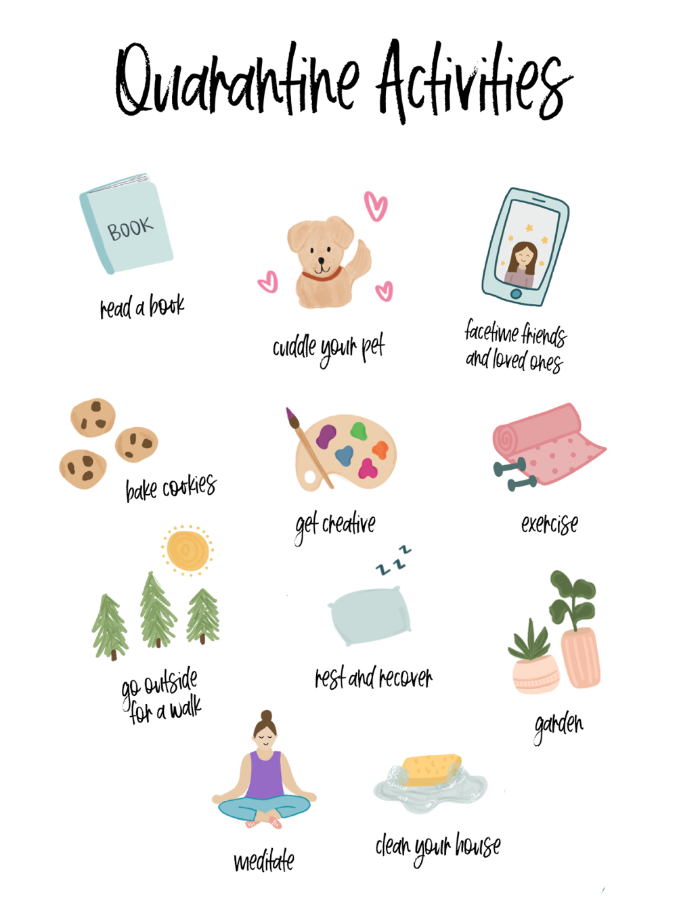

# A guide to survive the COVID-19 lockdown(s)

Photo owned by [csuchico.edu](https://www.csuchico.edu/)

Not sure how to spend time on lockdown? This guide contains a range of different activities to choose from.

## Categories
* [Walks in Town](#walks)
* [Virtual Tours-Trips](#trips-tours)
* [Movies-Documentaries-Series](#movies-docum-series)
* [Books](#books)
* [Exercise](#exercise)
* [Learn a new skill](#new-skill)
* [Cooking](#cooking)
* [Start a new Project](#projects)
* [Video Games](#video-games)
* [Board Games](#board-games)
* [Music](#music)
* [Facetime your long-distance friends](#facetime)
* [Art](#art)

[!Note : Before you head outside](#note)

## Walks in Town
This category has no interesting activities yet.

## Virtual Tours-Trips
This category has no interesting activities yet.

## Movies-Documentaries-Series
_The most common activity during  lock-down has been watching movies. So here are my recommendations for movies, series and documentaries:_

|TITLE| TYPE| AVAILABLE ON| MY RATING| TRAILER|
|---| ---| ---| ---| ---|
|Don't f**k with cats| Documentary - TV series| Netflix| 9/10| [TRAILER](https://www.youtube.com/watch?v=x41SMm-9-i4&ab_channel=Netflix "Don't f**k with cats")|
|Breaking Bad| TV series| Netflix| 9/10| [TRAILER](https://www.youtube.com/watch?v=HhesaQXLuRY&ab_channel=TrailerBlend "Breaking Bad")|
|The Boys| TV series| AmazonPrime| 7/10| [TRAILER](https://www.youtube.com/watch?v=M1bhOaLV4FU&ab_channel=AmazonPrimeVideoUK "The Boys")|
|Connected| Documentary - TV series| Netflix| 8.5/10| [TRAILER](https://www.youtube.com/watch?v=B-aZrftUPlk&ab_channel=Netflix "Connected")|
|Lupin| TV series| Netflix| 7.5/10| [TRAILER](https://www.youtube.com/watch?v=ga0iTWXCGa0&ab_channel=Netflix "Lupin")|
|The Social Dilemma| Documentary| Netflix| 7/10| [TRAILER](https://www.youtube.com/watch?v=uaaC57tcci0&ab_channel=Netflix "The Social Dilemma")|
|Joker| Drama | Amazon | 10/10 | [TRAILER](https://www.youtube.com/watch?v=zAGVQLHvwOY "Joker")|

## Books

|TITLE| TOPIC | AVAILABLE ON| MY RATING| Link |
|---| ---| ---| ---| ---|
|Thinking, Fast and Slow | Psychology | Amazon | 9/10| [Link](https://www.amazon.de/Thinking-Fast-Slow-Daniel-Kahneman/dp/0141033576/ref=sr_1_1?__mk_de_DE=%C3%85M%C3%85%C5%BD%C3%95%C3%91&crid=391NW1M3NG4SX&dchild=1&keywords=think+fast+and+slow&qid=1616005195&sprefix=think+fast%2Caps%2C216&sr=8-1 "Thinking, Fast and Slow")|

## Exercise 
Different kind of exercises and sports you can do during the pandemic:

* Freeletics (bodyweight workout)
* HIT (High Intensity Training)

## Learn a new skill
Great ideas to learn new skills:

* Learn a new programming language
* Learn new foreign language

## Cooking

|Receipt| Country |  MY RATING| Link |
|---| ---| ---| ---|
| Tzatziki | Greece | 10/10| [Link](https://cookieandkate.com/how-to-make-tzatziki/ "How to Make Tzatziki")|
## Start a new Project

Ideas for interesting projects:

* Use a Raspberry Pi to measure the room temperature and humidity 

## Video Games

Amazing video games you must try out:

* FIFA 2021
* GTA San Andreas

## Board Games
This category has no interesting activities yet.

## Music
Music is probably the best way to survive while at home. Whether you headbang while doing your assignments, sing at the shower or leave the computer to stretch your fingers with that chord, you have probably already noticed that slight brightening to your soul.

### Musical Instruments
You are never actually too old to learn to play an instrument you have always liked. It is a perfect break from your laptop's screen.

## Facetime your long-distance friends
Have video chats to remember the nights when you used to hangout for hours with your friends.Use Skype, FaceTime and Microsoft Teams to help you with that!

## Art
This category has no interesting activities yet.

## !Note : Before you head outside
1. *Be sure you wear a mask*
2. *Don't forget to sent the obligatory SMS text message to 13033*:
You can send SMS from your mobile phone to 13033 free of charge.
The SMS must be in the following format:

        X [blank] full name and home address

    where X is the reason for movement 1, 2, 3, 4, 5, 6 corresponding to the following reasons:

    1. Movement to the pharmacy or visiting a doctor or to donate blood, in the case that this is recommended after a previous communication.
    2. Movement to an in-service supply store of basic goods (supermarket, mini-market), where they cannot be sent out.
    3. Movement to a public service or bank, insofar as electronic transaction is not possible.
    4. Movement to help people in need or escort minors to/from school.
    5. Movement to a funeral ceremony under the conditions laid down by law or movement of divorced or separated parents necessary to ensure communication between parents and children, in accordance with the provisions in force.
    6. Physical exercise outdoors or movement with a pet, individually or per three persons, in the latter case having regard to the necessary distance of 1.5 m.

    You will receive the following in response:

        Movement [blank] X [blank] full name and address of residence

    *Source:* https://forma.gov.gr/en/
3. *Be sure to comply with the law*: (description needed)
