# A guide to survive the COVID-19 lockdown(s)

Photo owned by [csuchico.edu](https://www.csuchico.edu/)

Not sure how to spend time in lockdown? This guide contains a range of different activities to choose from.

## Categories
* [Anime](#anime)
* [Art](#art)
* [Binge Youtube](#youtube)
* [Board Games](#board-games)
* [Books](#books)
* [Clean and organize](#clean)
* [Cocktail Adventures](#cocktails)
* [Coding Projects](#coding-projects)
* [Cooking](#cooking)
* [Covid-19 Infection](#covid-infection)
* [Discover Space](#Discover-Space)
* [Down the rabbit hole](#conspiracies)
* [Drinking games](#drinking-games)
* [Exercise](#exercise)
* [Facetime your long-distance friends](#facetime)
* [Gardening](#gardening)
* [Learn a new skill](#new-skill)
* [Meditation](#meditation)
* [Movies-Documentaries-Series](#movies-docum-series)
* [Music](#music)
* [Online Courses](#online_course)
* [Outdoor Activities with Friends](#outdoor_activities)
* [Plan your Erasmus](#erasmus)
* [Plan your next trip](#trips)
* [Pranks](#pranks)
* [Social Movements](#social-movements)
* [Start a new Project](#projects)
* [Start listening to Podcasts](#podcasts)
* [Trippy Gifs](#trippygifs)
* [Video Games](#video-games)
* [Video Making](#videomaking)
* [Virtual Tours-Trips](#trips-tours)
* [Create your own Video Game](#create-video-game)
* [Walks in Town](#walks)
* [What to avoid](#whattoavoid)
* [Work with cars](#Work-with-cars)
* [Writing](#writing)
* [Healthy Lifestyle](#health)

[Note : Before you head outside](#note)

---

## Anime

### What is Anime

Anime describes all animated work , despite of style and origin until early 2000's anime was produced strictly by and for Japan , in the last 20 years we have seen anime growing into a worldwide phenomenon creating a fanbase of millions and being translated into numerous languages . A whole generation of viewers myself included have grown watching their favorite anime , turning what was once "branded" as child-show and cartoon into a something everyone can and should enjoy in their free time. 

### My Hero Academia (from 2016)

**My Hero Academia (僕のヒーローアカデミア)** continues to be one of the most popular ongoing anime getting traction incredibly fast . A Shonen anime about a young boy called Izuku born without power's in a world dominated by heroes
and villains that are born with extraordinary power's ,called quirks what is going to happen when he will inherit the world's strongest power by the world's strongest hero All Might? 

Air Dates: from 2016| 
Genre: Action, Fantasy|
Recommended for Beginners

Pictures Taken from IMBd

### Death Note (from 2016)

**Death Note (デスノート)** is a mystery/horror anime , based loosely on the manga published in the period 2003-2006 receiving great reviews by both japan and international viewers alike. A well elaborated but short story that is sure to keep you on your toes. Light Yagami is the protagonist that develops a god syndrome after discovering a notebook that kills whoever gets their name written on it. 

Air Dates: 2006-2007|
Genre: Mystery|
Recommended for Beginners/Anime Fans

Pictures Taken from IMBd

### Tokyo Ghoul (2014-2018)

**Tokyo Ghoul (東京喰種トーキョーグール)** is a dark fantasy anime, depicting a world inhabited by ghouls that are seemingly human blending in society, the problem is that they need human flesh to survive . Our protagonist is Kaneki-Kun a young student that spirals uncontrollably in the underworld of ghouls trying to find his place in the world after a transplantation change's his life for ever.

Air Dates: 2014-2018|
Genre: Dark Fantasy|
Recommended for Anime Fans/Anime Freaks|

Pictures Taken from IMBd

### Naruto (2007-2017)

**Naruto (東京喰種トーキョーグール)** is about a young boy called naruto that carries the heavy burden of keeping a tailed beast the demonic fox inside of him while living in the dangerous world of ninjas . Naruto is a fan favorite that anyone who enjoys a great adventure should take the time to enjoy.

Air Dates: 2007-2017|
Genre: Shonen , Adventure|
Recommended for Beginners , Younger Audience|

Picture taken from Imbd

### One Piece (1997-present)
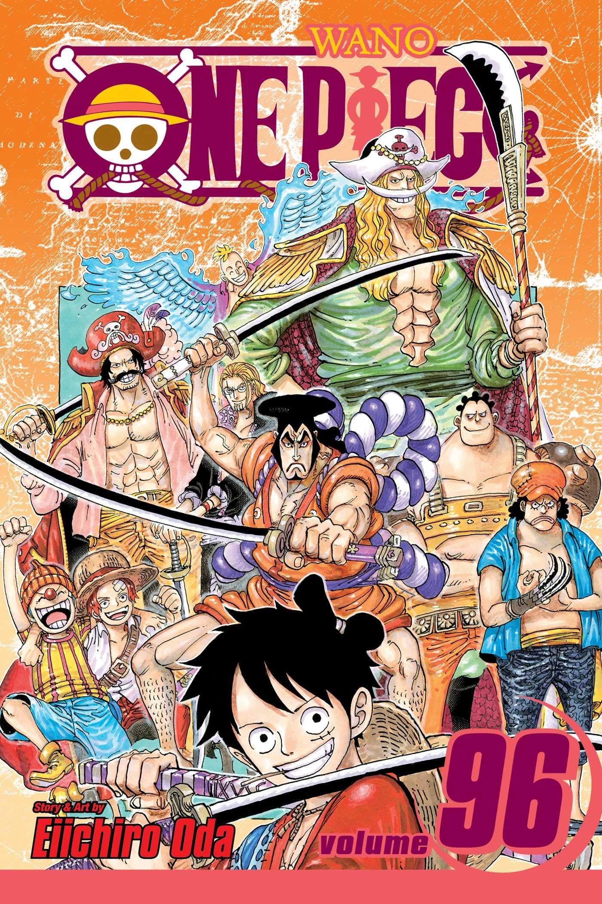

**One Piece (東京喰種ワンピース)** is one of the most popular manga and anime series of all time. The story is about the adventures of  Monkey D. Luffy, a young ambitious pirate whose body attained the properties of rubber after accidentally eating a Devil Fruit. With his pirate crew called Straw Hat Pirates, Luffy sets sail in pursuit of the world's most valuable treasure known as "One Piece" aiming to eventually be the next King of Pirates. One Piece has released more than 965 episodes and is still releasing new ones every week. Both the anime and the manga have received multiple awards over the course of years.

Air Dates: from 1997 
Genre: Adventure, Fantasy, Action
Recommended for Beginners

Image Source for One Piece pictures is  [One Piece Fandom Wiki](https://onepiece.fandom.com/wiki/One_Piece_Wiki)

### Dragonball (From 1984)
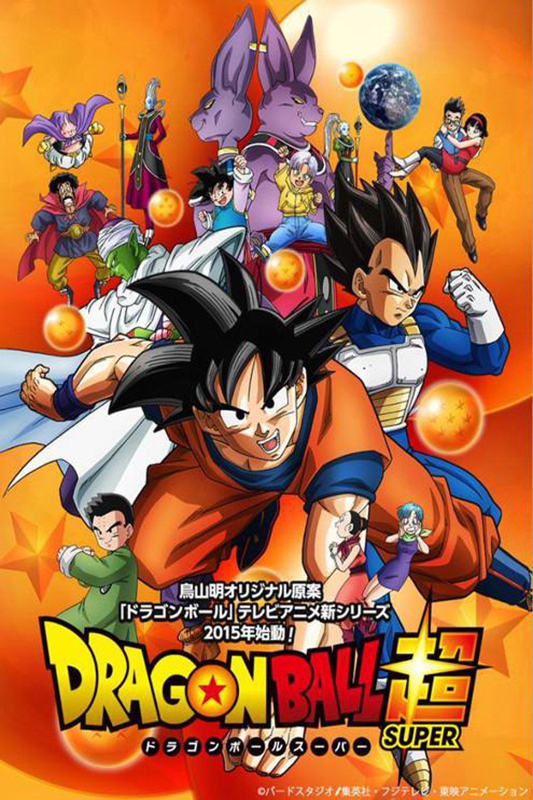

**Dragonball (東京喰種トーキョーグール)** is perhaps the most well-known anime in the western world releasing episodes for more than 35 years , and for good reason it is a fan favorite and the easiest way to get your friends into anime. The story depicts the life of Goku an alien from the planet Vegeta , with super-powers following him in his adventures and the everlasting responsibility of protecting earth whom he dearly loves. 

Air Dates: Action, Adventure
Genre: from 1984
Recommended for Beginners

Image Source for pictures is  [IMBd](https://www.imdb.com)

### Attack on titan (From 2013)

**Storyline**

Humans are nearly exterminated by giant creatures called Titans. Titans are typically several stories tall, seem to have no intelligence, devour human beings and, worst of all, seem to do it for the pleasure rather than as a food source. A small percentage of humanity survived by walling themselves in a city protected by extremely high walls, even taller than the biggest of titans. Flash forward to the present and the city has not seen a titan in over 100 years. Teenage boy Eren and his foster sister Mikasa witness something horrific as the city walls are destroyed by a colossal titan that appears out of thin air. As the smaller titans flood the city, the two kids watch in horror as their mother is eaten alive. Eren vows that he will murder every single titan and take revenge for all of mankind.

Genres: Animation | Action | Adventure | Drama | Fantasy | Horror

Image source and info [imdb](https://www.imdb.com/title/tt2560140/)

### Jujutsu Kaisen (From 2020)

**Storyline**

Yuji Itadori, a kind-hearted teenager, joins his school's Occult Club for fun, but discovers that its members are actual sorcerers who can manipulate the energy between beings for their own use. He hears about a cursed talisman - the finger of Sukuna, a demon - and its being targeted by other cursed beings. Yuji eats the finger to protect his friends, and ends up becoming Sukuna's host. However, Yuji discovers that he has inherited magic and is able to control this power without interference from Sukuna. He joins the Tokyo Metropolitan Magic Technical College to consumes all of Sukuna's fingers, which will enable a full exorcism to take place that will free him.

Genres: Animation | Action | Adventure | Fantasy | Thriller

Image source and info [imdb](https://www.imdb.com/title/tt12343534/?ref_=nv_sr_srsg_0)

### Black Clover (From 2017)

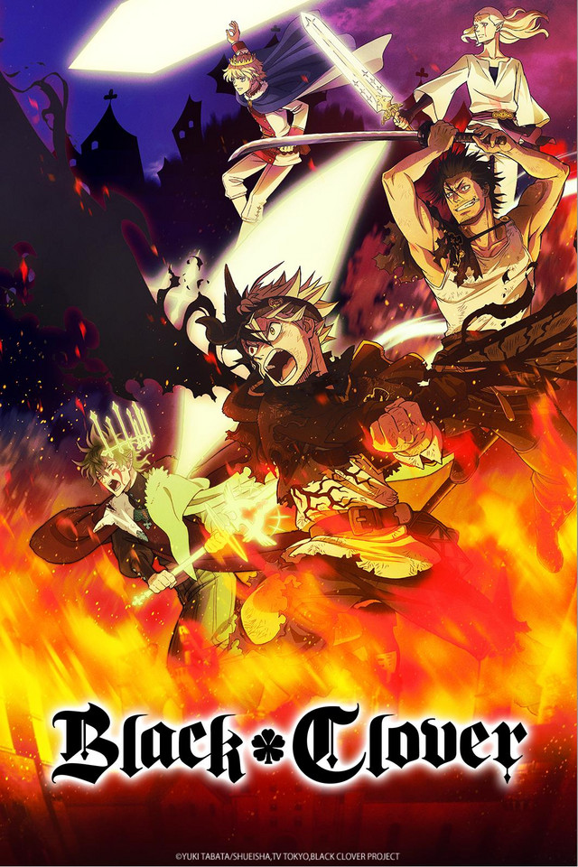

**Storyline**

Asta and Yuno were abandoned together at the same church and have been inseparable since. As children, they promised that they would compete against each other to see who would become the next Emperor Magus. However, latrine as they grew up, some differences between them became plain. Yuno was a genius with magic, with amazing power and control, while Asta could not use magic at all, and tried to make up for his lack by training physically. When they received their Grimoires at age 15, Yuno got a spectacular book with a four-leaf clover (most people receive a three-leaf-clover), while Asta received nothing at all. However, when Yuno was threatened, the truth about Asta's power was revealed, he received a five-leaf clover Grimoire, a "black clover". Now the two friends are heading out in the world, both seeking the same goal.

Genres: Animation | Action | Adventure | Comedy | Drama | Fantasy | Sci-Fi | Thriller

Image source and info [imdb](https://www.imdb.com/title/tt7441658/?ref_=nv_sr_srsg_0)

---

## Art
Creating art can be of so many different types. It can be painting, constructing some art piece from recycled 
materials, or also decorating your apartment/room. Especially painting can calm you really down and give you the 
opportunity to express your feelings and emotions by using colors. The following tutorials will help you to make 
the first step to become an artist and use the time during the pandemic more efficiently:

* [Acrylic Painting Tutorial - Ocean Sunset (Beginner to Intermediate)](https://www.youtube.com/watch?v=VjCGJb5ltZM "Acrylic Painting")
* [10 wonderful recycle do it yourself crafts that will brighten your room](https://www.youtube.com/watch?v=HkHEJEzMKwc "Recycling Crafts")
* [24 cool decorative ideas you can do it yourself](https://www.youtube.com/watch?v=Uv-KC7szPN0 "Decorating Methods")
* [Origami - Japanese Paperfolding Technique](https://www.origamiway.com/easy-origami.shtml "Origami Technique")
* [EASY Step By Step Digital Collage TUTORIAL | NO DRAWING SKILLS REQUIRED | How To For Beginners](https://www.youtube.com/watch?v=xl3Zj_JgYKk "Digital Collage Tutorial")
* [Basics of charcoal drawing](https://www.google.com/search?q=carbon+drawing&sxsrf=ALeKk00M9bDB-PlzL-DCft_0ae4hcXj4Dg%3A1616191227070&ei=-x5VYLHdA-anrgT0yrj4Dw&oq=carbon+drow&gs_lcp=Cgdnd3Mtd2l6EAEYADIICAAQFhAKEB4yBggAEBYQHjIICAAQFhAKEB4yCAgAEBYQChAeMgYIABAWEB4yBggAEBYQHjIGCAAQFhAeOgQIIxAnOgQIABBDOggIABCxAxCDAToLCAAQsQMQxwEQowI6BQgAELEDOggILhCxAxCDAToECC4QQzoHCAAQsQMQQzoFCC4QsQM6AggAOggIABDHARCvAToECAAQCjoKCAAQxwEQrwEQCjoFCAAQywFQ3ClYqkBg9lpoAHACeACAAb4BiAHyDpIBBDAuMTKYAQCgAQGqAQdnd3Mtd2l6wAEB&sclient=gws-wiz#kpvalbx=_CB9VYN7QEOKwrgSlxZPQDg19 "Charcoal Drawing")
* [Adult Colouring Books](https://www.amazon.com/s?k=adult+coloring+book&crid=3S3IZCUX5I7KQ&sprefix=adult+colo%2Caps%2C193&ref=nb_sb_noss_2)
* [Beginner's guide to Digital Art](https://www.youtube.com/watch?v=5pmIYH1ugtk&ab_channel=Nadiaxel)

---

## Binge Youtube
Youtube is an American owned video-sharing platform with headquarters located in California . Being the second most visited website in 2020 it has long evolved from it's days of being a platform for users to upload random content they thought was funny or interesting , nowadays it can provide meaningful content that could surely accompany us in the lonely days the quarantine has given us.Below you can find some channels I thought could interest you. 

### Notable Channels

|Channel Name|Content Type| Subscribers|Channel Link|
|---| ---| ---| ---|
|James Bond 007|James Bond News| 441.000| [Link](https://www.youtube.com/channel/UCwTkM6CvIsYFaFiMKIKCqHw)|
|Ownage Pranks|Animated Phone Pranks| 5.340.000| [Link](https://www.youtube.com/channel/UCxOGHW-aqciBe5Wjq8ltzOg)|
|Comedy Lab|Greek Comedy| 636.000| [Link](https://www.youtube.com/channel/UCiOkLGlj4azqep3O_J0wLkw)|
|Luben|Trolling Greece| 354.000| [Link](https://www.youtube.com/channel/UCOXgW2DaRkuyDlOf96ffhmg)|
|Tipsy Bartender|Cocktail Guides| 4.200.000| [Link](https://www.youtube.com/channel/UCaDY8WjYWy36bnt0RVzSklw)|
|Nightblue3|Gaming-League of Legends| 2.590.000| [Link](https://www.youtube.com/channel/UCN078UFNwPgwWlU_V5WCTNw)|
|CoralFish12g|Aquarium Hobbyists| 803.000| [Link](https://www.youtube.com/channel/UCXoCSxSbh2d5DAlA5FiyuOQ)|
|12os Pithikos|Greek Rap| 160.000| [Link](https://www.youtube.com/channel/UC8J0vy5x7scOm6itUxWH8gg)|
|Crunchyroll Collection|Anime Clips| 2.870.000| [Link](https://www.youtube.com/channel/UC6pGDc4bFGD1_36IKv3FnYg)|
|Slappers Only|Comedy Videos| 435.000| [Link](https://www.youtube.com/user/EmersonStevie)|
|Based Zeus|Life Advice for Men| 1.400.000| [Link](https://www.youtube.com/channel/UC1PkRYud11ogYDqgdqd23Zw)|
|Astronio|Making Astronomy Fun| 193.000| [Link](https://www.youtube.com/channel/UCYhH65nE2M8rGwMWvAlVu2A)|
|Netwix|Greek Comedy Videos| 615.000| [Link](https://www.youtube.com/channel/UCLexrmd9Dn8SnzdsZZcavYQ)|

Don't be hesitant to enrich the list with your favorite channels ,sharing is caring in these hard times.

---

## Board Games
Board Games are a great way to have fun and spend your time with family and friends!

### Online board games
Below you may find some interesting websites where you can play different board games along with your friends:

* [Among Us](https://www.bluestacks.com/apps/action/among-us-on-pc.html): The game takes place in a space-themed setting, in which players each take on one of two roles, most being Crewmates, and a predetermined number being Impostors. The goal of the Crewmates is to identify the Impostors, eliminate them, and complete tasks around the map; the Impostors' goal is to covertly sabotage and kill the Crewmates before they complete all of their tasks. Players suspected to be Impostors may be eliminated via a plurality vote, which any player may initiate by calling an emergency meeting (except during a crisis) or reporting a dead body. Crewmates win if all Impostors are eliminated or all tasks are completed whereas Impostors win if there is an equal number of Impostors and Crewmates, or if a critical sabotage goes unresolved.
* [Chess](https://www.chess.com/): Probably the most famous strategy game.
* [GeoGuessr](https://www.geoguessr.com/): The goal of this game is to guess the location of a specific spot on the globe presented to you via google maps street view. You can either play alone, or with friends. The closer your guess to the selected location, the more point you gather. The winner of the game is the person with the most points at the end of a specified number of rounds.
* [League of legends: Wild Rift](https://wildrift.leagueoflegends.com/en-gb/): A 5v5 MOBA experience of League of Legends, now built from the ground up for mobile and console. With fresh controls and fast-paced games, players of every level can team up with friends, lock in their champion, and go for the big plays
* [Password](https://www.thegamegal.com/2017/11/10/password): The goal of this game is to get your partner to guess the password by giving him a one word and only one word clue. First, you divide yourselves into 2 teams and in each round one of the members from each team will be given a password. If your partner guesses the password then your team wins the points of the round, but if he doesn't, then it's the other team’s turn. If their team gets the password, they get the points. If the other team also doesn’t get the word you get another try. So, this goes on for 3 times till someone gets the password and then the next round starts. It's a really entertaining game to play with your friends. **Pro Tip**: Turn this into a drinking game and you'll maximize the fun!*([download it here](https://play.google.com/store/apps/details?id=in.androidmate.password_game))*
* [Playing cards](https://playingcards.io/): PlayingCards.io simply provides a synchronized card playspace. It's up to you to start the game, enforce rules, and determine the winner, just like a real deck of cards!
* [Pretend you're xyzzy](https://pyx-1.pretendyoure.xyz/zy/game.jsp): Pretend You're Xyzzy is a Cards Against Humanity clone! *([github repo](https://github.com/ajanata/PretendYoureXyzzy))*
* [Rento](https://playrento.com/): Rento is online multiplayer monopoly clone. The game is for 2 to 6 players and you can play it online versus friends, offline versus bots. In the game you trade lands, build houses, win auctions, go and most importantly - have fun. Your goal is to acquire monopoly and bankrupt the other players.
* [Scribbl](https://skribbl.io/): skribbl.io is a free multiplayer drawing and guessing game. One game consists of a few rounds in which every round someone has to draw their chosen word and others have to guess it to gain points! The person with the most points at the end of game will then be crowned as the winner!
* [Settera](https://www.seterra.com/): Learning geography doesn't have to be boring. Do it the easy way with Seterra! In no time, you could learn to locate every single country in the world on a map.
Seterra includes fun quizzes that help familiarize you with countries, capital cities, flags, rivers, lakes, and notable geological features.
* [Spyfall](https://www.spyfall.app/): Spyfall is a fun game that really tests your improvise abilities! You and your friends virtually attend an event and you all get assigned different roles. However, one of you is a spy and has no idea about the event you are attending. Try to figure out who the spy as soon as possible!
* [The Wiki Game](http://thewikigame.com/): In this game, you have to navigate around wiki pages and guess. You start from a specific Wikipedia page and within a specified time limit, you have to go to another target Wikipedia page using the available hyperlinks.

### Classic board games
If you are stuck at home with your family or your roommate(s), you could try one of these fun board games:

* [Bang!](https://en.wikipedia.org/wiki/Bang!_(card_game)): In this Wild-West themed game, a sheriff and a deputy sheriff are trying to uncover the outlaws. It sounds easy, but what happens when you don't know who the outlaws are?
* [Battleship](https://en.wikipedia.org/wiki/Battleship_(game)): A strategy type guessing game for two players. It is played on ruled grids (paper or board) on which each player's fleet of ships (including battleships) are marked. The locations of the fleets are concealed from the other player. Players alternate turns calling "shots" at the other player's ships, and the objective of the game is to destroy the opposing player's fleet. 
* [Citadels](https://en.wikipedia.org/wiki/Citadels_(card_game)): A card game in which on each round, players pick a role, build districts and make actions according to their role.
* [Cluedo](https://en.wikipedia.org/wiki/Cluedo): A suspenseful murder mystery game that turns everyone into a detective.
* [Halli Galli](https://www.ultraboardgames.com/halli-galli/game-rules.php): A fast game in which you have to ring the bell as soon as 5 same fruits appear. Just watch for your hands!
* [Jenga](https://en.wikipedia.org/wiki/Jenga): Jenga is a game of physical skill. Players take turns removing one block at a time from a tower constructed of 54 blocks.
* [Munchkin](https://en.wikipedia.org/wiki/Munchkin_(card_game)): Munchkin is a dedicated deck card game by Steve Jackson Games, written by Steve Jackson and illustrated by John Kovalic. It is a humorous take on role-playing games, based on the concept of munchkins (immature role-players, playing only to "win" by having the most powerful character possible).In Munchkin, all players start at level 1, with the goal of reaching level 10 (or level 20 in Epic Level games). Players primarily progress by killing monsters, and level up every time they kill a monster. However, players can freely use cards against monsters and other players during play, allowing them to either assist or to sabotage others during their turn. Each person's turn begins when they "kick down the door" by drawing a Door Card face-up. A Door Card can be one of the following types: a Monster Card, which the player must engage by fighting or fleeing; a Curse Card, which applies an effect; or an Item Card, Race Card, or Class Card, which the player adds to their hand. If the card drawn is not a Monster Card, the player can either "loot the room" by drawing a face-down door card and adding it to their hand, or "look for trouble" by playing a Monster Card from their hand to fight it.
* [Monopoly](https://en.wikipedia.org/wiki/Monopoly_(game)): The classical buying and trading properties game. 
* [Risk](https://en.wikipedia.org/wiki/Risk_(game)): A strategy board game which combines war, debate, diplomacy, conflicts, and luck. Each player has a quest to complete (usually to take over a continent) but so do your opponents. 2-6 Players, 1-8 hours. Do not play this game with your best friends, it will be the end of a friendship...  
* [Scrabble](https://en.wikipedia.org/wiki/Scrabble): A game in which you use random letters to create words.
* [Stratego](https://en.wikipedia.org/wiki/Stratego): A Napoleonic version of capture the flag!
* [Taboo](https://en.wikipedia.org/wiki/Taboo_(game)): The game of forbidden words. In Taboo, your goal is to get your teammate to say the word written on one of the game cards without saying that word or any of the “taboo” words also listed with it.
* [Tichu](https://en.wikipedia.org/wiki/Tichu): Tichu (also known as Haris) is a multi-genre card game; primarily a shedding game that includes elements of Bridge, Daihinmin, and Poker played between two teams of two players each. Teams work to accumulate points; the first team to reach a predetermined score (usually 1,000 points) is the winner. You can also play online at: [dod.games](https://www.dod.gr/?app=games)
* [Ticket to Ride](https://en.wikipedia.org/wiki/Ticket_to_Ride_(board_game)): A strategy game in which players collect train cards and use them in order to create train routes across a real world map and collect points. The purpose of the game is to collect the most points. This can be achieved by creating long railways and connecting remote cities which are determined by drawing ticket cards. This board game is ideal for people who like strategy, and love using..... Optimization Methods. :stuck_out_tongue:
* [Trivial Pursuit](https://en.wikipedia.org/wiki/Trivial_Pursuit): A game to test your knowledge about things around the globe.
* [Twister](https://en.wikipedia.org/wiki/Twister_(game)): As the box promises, have you twisted up in knots and probably doubled over laughing, too.
* [Wizard](https://en.wikipedia.org/wiki/Wizard_(card_game)): A fun card game that comes with a set of tricky rules. Each player has guess the results of the game and the winner is the one who makes the best guesses. 
  
### Puzzles' Bestsellers

* Katosca 1,000 Piece Jigsaw Puzzle. [Buy it from amazon.](https://www.amazon.com/Katosca-Jigsaw-Puzzles-Astronaut-Educational/dp/B07RHSKLYL)
* Moruska 1,000 Piece Gradient Rainbow Jigsaw Puzzle. [Buy it from banggood.](https://www.banggood.com/1000-Pieces-Thousands-Of-Colors-Rainbow-Coil-Series-Childrens-Gift-Jigsaw-Puzzle-Toy-Educational-Toys-p-1654342.html?utm_source=googleshopping&utm_medium=cpc_organic&gmcCountry=GR&utm_content=minha&utm_campaign=minha-gr-en-pc&currency=EUR&cur_warehouse=USA&createTmp=1&ID=528218&utm_source=googleshopping&utm_medium=cpc_bgs&utm_content=sxxx&utm_campaign=sxxx-ssc-gr-en-all-newcustom-ncv65-0409&ad_id=430724963733&gclid=Cj0KCQjwjPaCBhDkARIsAISZN7Q--mXvBmCI8-JlruhaZyEpmkm4MaucElhb1WD2k3YGo2OZFMS1O6MaAnk5EALw_wcB)
* Gray Malin 500 Piece Snow Jigsaw Puzzle. [Buy it from amara.](https://www.amara.com/ie/products/the-snow-double-sided-puzzle?utm_source=google&utm_medium=cpc&amss=ldo&pdg=pla-296303633664:kwd-296303633664:cmp-6772810709:adg-84881265732:crv-388972891590:pid-191950:dev-c&__currency=EUR&amss=kbz&gclid=Cj0KCQjwjPaCBhDkARIsAISZN7TQUSWMeAZ_zhnOExxAdz_2FMsty803VJZe4ZA-5Uye-rakWUSMV1YaAixYEALw_wcB)
* Custom Hometown Map Puzzle. [Buy it from amazon.](https://www.amazon.com/Personalized-Hometown-Map-Jigsaw-Mapping/dp/B00LLDPQ22)
* New York Times Custom Front Page Puzzle. [Buy it from uncommongoods.](https://www.uncommongoods.com/product/new-york-times-custom-front-page-puzzle)

Source:[today.com](https://www.today.com/shop/best-puzzles-adults-2020-t171244) 

---

## Books

The best way to spend quarantine time away from your computer is to read a book. You do not need to read books to learn something new. Books, like all things, are divided into categories according to their purpose (eg educational purpose) and their subject matter. In the table below you can find a variety of books for all tastes:

Photo owned by [elearningindustry.com](https://elearningindustry.com/top-10-books-every-college-student-read)

|TITLE| TOPIC | AUTHOR | AVAILABLE ON| MY RATING| LINK |
|---| ---| ---| ---| ---| ---|
|Animal Farm | Classic Literature| Orwell George | Public | 9.3/10 | [Link](https://www.public.gr/product/books/idiotika-sholeia-kolegia/international-baccalaureate/animal-farm/prod82326pp/ "Animal Farm")|
|1984 | Classic Literature| Orwell George | Public | 9/10 | [Link](https://www.public.gr/product/books/greek-books/literature/translated-literature/1984/prod254453/?gclid=Cj0KCQjwo-aCBhC-ARIsAAkNQisl4ukxjR0JQ1OTTY7rRJF_Pxphu9OZteR2mxrzxVa-igf_gz4PJC0aAvXyEALw_wcB "1984")|
|21 Lessons for the 21st Century | Non-Fiction | Yuval Noah Harrari | Amazon | 9/10 | [Link](https://www.amazon.com/gp/product/B079WM7KLS/ref=dbs_a_def_rwt_bibl_vppi_i1)|
|Algorithms to Live By: The Computer Science of Human Decisions | Non-Fiction | Brian Christian & Tom Griffiths | Amazon | 9.5/10 | [Link](https://www.amazon.com/Algorithms-Live-Computer-Science-Decisions/dp/1627790365)|
|Atlantis | Historical Novel | David Gibbins | Amazon| 10/10| [Link](https://www.amazon.com/gp/product/0755324226/ref=x_gr_w_bb_sout?ie=UTF8&tag=x_gr_w_bb_sout-20&linkCode=as2&camp=1789&creative=9325&creativeASIN=0755324226&SubscriptionId=1MGPYB6YW3HWK55XCGG2) |
|Chaos | History & Science | James Gleik | bookstores | 7/10 | [Link](https://www.amazon.com/Chaos-Making-Science-James-Gleick/dp/0143113453) |
|Crime and Punishment | Crime fiction | Fyodor Dostoevsky | Amazon| 9/10| [Link](https://www.amazon.com/Crime-Punishment-Volokhonsky-Translation-Classics/dp/0679734503/ref=sr_1_1?crid=2ECOFGIAH7E7F&dchild=1&keywords=crime+and+punishment&qid=1616082855&sprefix=crime+and%2Caps%2C312&sr=8-1)|
|Factfulness | Non-Fiction | Hans Rosling | Amazon | 9/10 | [Link](https://www.amazon.com/Factfulness-Reasons-World-Things-Better/dp/1250123828/ref=sr_1_1?crid=AWTNDRHKCZMH&dchild=1&keywords=factfulness&qid=1616416120&s=books&sprefix=factful%2Cstripbooks-intl-ship%2C266&sr=1-1)|
|Homo Deus: A Brief History of Tomorrow | Non-Fiction | Yuval Noah Harrari | Amazon | 10/10 | [Link](https://www.amazon.com/Homo-Deus-Brief-History-Tomorrow/dp/0062464345/ref=pd_lpo_14_img_0/138-6955471-0282806?_encoding=UTF8&pd_rd_i=0062464345&pd_rd_r=79940c5c-c962-4bff-97f0-d312b9386d69&pd_rd_w=eY4eA&pd_rd_wg=OWlZW&pf_rd_p=337be819-13af-4fb9-8b3e-a5291c097ebb&pf_rd_r=76HARP4SKM7BRFS4FGE9&psc=1&refRID=76HARP4SKM7BRFS4FGE9)|
|Influence: The Psychology of Persuasion | Psychology | Robert B. Cialdini | Amazon| 9.5/10| [Link](https://www.amazon.com/Influence-Psychology-Persuasion-Robert-Cialdini/dp/006124189X) |
|Little Women | Classic Novel | Alcott Louisa | Public | 9/10 | [Link](https://www.public.gr/product/mikres-kyries/prod851670pp/)|
|Murder on the Orient Express | Crime Novel | Agatha Christie | Amazon | 9/10 | [Link](https://www.amazon.com/Murder-Orient-Express-Hercule-Mysteries/dp/0062073508)|
|Norwegian Wood | Fiction | Haruki Murakami | Amazon | 9/10 | [Link](https://www.amazon.com/Norwegian-Wood-Haruki-Murakami/dp/1860468004)|
|Pharaoh | Historical Novel | Valerio Manfredi | Amazon| 10/10| [Link](https://www.amazon.com/gp/product/0230530737/ref=x_gr_w_bb_sout?ie=UTF8&tag=x_gr_w_bb_sout-20&linkCode=as2&camp=1789&creative=9325&creativeASIN=0230530737&SubscriptionId=1MGPYB6YW3HWK55XCGG2) |
|Rich Dad Poor Dad | Personal Finance |  Robert T. Kiyosaki | Amazon| 9.5/10| [Link](https://www.amazon.com/Rich-Dad-Poor-Teach-Middle/dp/1612680194) |
|Sapiens: A Brief History of Humankind | Non-Fiction | Yuval Noah Harrari | Amazon | 10/10 | [Link](https://www.amazon.com/Sapiens-Humankind-Yuval-Noah-Harari/dp/0062316095)|
|Six of Crows | Fantasy, Fiction | Leigh Bardugo | Amazon | 9/10 | [Link](https://www.amazon.com/Six-Crows-Leigh-Bardugo-ebook/dp/B00UG9LC4I)|
|Steal Like An Artist | Creativity | Austin Kleon | Bookstores | 9/10 | [Link](https://www.amazon.de/-/en/Austin-Kleon/dp/0761169253/ref=sr_1_1?adgrpid=82460957179&dchild=1&gclid=Cj0KCQjwo-aCBhC-ARIsAAkNQitLQAkurrXgf3JUTAR4TFLTkE7sbYw1pCPzpWxsIQU1IDT6uN96zDcaAltvEALw_wcB&hvadid=394592758731&hvdev=c&hvlocphy=9067699&hvnetw=g&hvqmt=e&hvrand=9651998940140669448&hvtargid=kwd-297493624991&hydadcr=24491_1812059&keywords=steal+like+an+artist&qid=1616562423&sr=8-1)
|The Baltimore Boys| Fiction | Joël Dicker | Amazon | 9.5/10 | [Link](https://www.amazon.com/Baltimore-Alison-Anderson-translator-Dicker/dp/0857056867)|
|The Fifth Season | Science fantasy | N. K. Jemisin | Amazon | 9/10 | [Link](https://www.amazon.com/Fifth-Season-Broken-Earth/dp/0316229296/ref=tmm_pap_swatch_0?_encoding=UTF8&qid=1616329101&sr=1-1)|
|The Ice Princess | Crime Novel | Camilla Läckberg | Public | 9.5/10 | [Link](https://www.public.gr/product/books/english/literature/crime-fiction/the-ice-princess/prod1150813pp/)|
|The Royal Game | Novella|  Stefan Zweig | Amazon| 8.5/10| [Link](https://www.amazon.com/Royal-Game-translated-Stefan-Zweig-ebook/dp/B08LBT67W2/ref=sr_1_4?dchild=1&keywords=the+royal+game&qid=1616082952&sr=8-4)|
|The Secret History | Modern Literature | Donna Tartt | Public | 9.5/10 | [Link](https://www.public.gr/product/books/english/literature/modern-literature/the-secret-history/prod141934/)|
|The Selfish Gene | Non-Fiction | Richard Dawkins | Amazon | 10/10 | [Link](https://www.amazon.com/Selfish-Gene-Anniversary-Landmark-Paperback/dp/B0722G5V92/ref=sr_1_2?crid=1Q7ZO9QVZSHC0&dchild=1&keywords=the+selfish+gene&qid=1616416041&s=books&sprefix=the+shelfi%2Cstripbooks-intl-ship%2C269&sr=1-2)|
|The Sixth Man: A Memoir | Autobiography| Andre Iguodala | Amazon| 9.5/10| [Link](https://www.amazon.com/The-Sixth-Man-audiobook/dp/B07N487TMC/ref=sr_1_1?crid=12L3C7BF27NT6&dchild=1&keywords=the+sixth+man+iguodala&qid=1616082921&sprefix=the+sixth+man+iguo%2Caps%2C384&sr=8-1)|
|The Unbearable Lightness of Being | Modern Literature | Milan Kundera | Public | 9.5/10 | [Link](https://www.public.gr/product/books/english/literature/modern-literature/the-unbearable-lightness-of-being/prod140346/)|
|Thinking, Fast and Slow | Psychology | Daniel Kahneman | Amazon | 9/10| [Link](https://www.amazon.de/Thinking-Fast-Slow-Daniel-Kahneman/dp/0141033576/ref=sr_1_1?__mk_de_DE=%C3%85M%C3%85%C5%BD%C3%95%C3%91&crid=391NW1M3NG4SX&dchild=1&keywords=think+fast+and+slow&qid=1616005195&sprefix=think+fast%2Caps%2C216&sr=8-1 "Thinking, Fast and Slow")|
|To Kill a Mocking Bird | Classic Literature | Harper Lee | Public | 9.5/10| [Link](https://www.public.gr/product/to-kill-a-mockingbird/prod1260555pp/) |
|We Hope This Reaches You in Time| poetry | Sin r.h. , King Holmes Samantha | Public | 9/10| [Link](https://www.public.gr/product/we-hope-this-reaches-you-in-time/prod10270092pp/ "We Hope This Reaches You in Time")|
|We Were Liars | Young Adult Fiction | E. Lockhart. | Amazon | 9/10 | [Link](https://www.amazon.com/We-Were-Liars-Lockhart/dp/0385741278/ref=sr_1_1?dchild=1&keywords=we+were+liars&qid=1616411727&s=books&sr=1-1)|
|When Nietzsche Wept | Modern Literature | Yalom Irvin D. | Public | 9/10 | [Link](https://www.public.gr/product/when-nietzsche-wept/prod2240341pp/ "When Nietzsche Wept")|
|Zero to One| Management | Pieter Thiel | Public | 9.5/10| [Link](https://www.public.gr/product/books/greek-books/economics/management/zero-to-one/prod6840642pp/ "Zero to One")|
|Προς τ'άστρα| Science| Παύλος Καστανάς| Public| 9/10|  [Link](https://www.public.gr/product/books/greek-books/natural-science/popular-science/pros-t-astra/prod12560011pp/?gclid=Cj0KCQjwjPaCBhDkARIsAISZN7SI5pPnqJ68ac1tcRHg9hRMr2VHwHRsfXB6iRGCm2eAJV3lH2N346YaAglmEALw_wcB "Προς τ'άστρα")
|Big Bang| Science| Simon Singh| Public |10/10| [Link](https://www.public.gr/product/big-bang/prod249173/?gclid=Cj0KCQjwjPaCBhDkARIsAISZN7TMTFMAJATZov3gBLTDVN6wgpI6tKZy6OQ21KzfgbF-3-QXS1BHDiYaArXoEALw_wcB "Big Bang")

---

##  Clean and organize
This is a great opportunity for you to clean and organize your space. Declutter, get rid of all the things you never use and organize the ones that you use. It will make you feel useful and you will have a clean, organized space at the end of the day. 

You can also write down your to-dos and organize your schedule and notes. It is best that you stay organized in order to achieve high productivity!

Best Apps for Organization and Productivity:
* Notion [Find it here](https://www.notion.so)
* Momentum Google Extension [Find it here](https://chrome.google.com/webstore/detail/momentum/laookkfknpbbblfpciffpaejjkokdgca?hl=en)
* Trello [Find it here](https://trello.com/en)
* Jour [Find it here](https://jour.com/)
* Todoist [Find it here](https://todoist.com/)
* Memento [Find it here](https://apps.apple.com/us/app/momento-diary-journal/id980592846)
* 24me Find it [here](https://apps.apple.com/us/app/24me-smart-personal-assistant/id557745942) for iOS and [here](https://play.google.com/store/apps/details?id=me.twentyfour.www&hl=en) for Android

Tips to Organize your Bedroom:
1. Designate a Home for Every Item
2. Utilize Under Bed Storage
3. Arrange Furniture by Frequency of Use
4. Store Seasonal Shoes Under the Bed
5. Create a Storage Nook
6. Use a Bedside Pocket Organizer
7. Go Minimalist
8. Use Personal Items as Decor
9. Store Your Hats on a Wall
* Information was taken from [here.](https://www.extraspace.com/blog/home-organization/room-organization/bedroom-organization-ideas-tips-hacks/)
---

##  Cocktail Adventures!
Let's be honest, Covid-19 pandemic and its several back-to-back lockdowns have been harsh for the most of us. Being in front of a screen for hours, unable to get in physical touch with our beloved ones and having our favorite restaurants and bars closed is an everyday struggle. After all that, the need to pour a glass (or two) of wine before bedtime comes naturally. 

So, we are here to just say that we understand and that it's time to level up the game; Cocktail adventure nights! Do you want to advance your bartender skills or feel like a little kid again? Well, as you discover new tasty horizons and mix up your favorite ingredients, the art of mixology will start to unfold and we promise you to enjoy those lockdown days as they are passing by. 

### Organize your space.
First things first; Before you start your mixing experiments, you need to set up your working station. There are not many things required for that, just the basic bar essentials and spirits of your preference.  
- Bar tool essentials: 
  1. Bar Spoons. You may already have some long-handle teaspoons but if you don't, you can find them [here](https://www.amazon.com/Hiware-Stirring-Stainless-Cocktail-Pattern/dp/B01EL7NAYU/ref=sr_1_9?keywords=bar+spoons&qid=1567433894&s=gateway&sr=8-9).
  2. Bottle opener & corkscrew. We are pretty sure everyone has at least one bottle opener of any kind. [Here](https://www.amazon.com/WHELVE-Mounted-Magnetic-Functional-Upcycled/dp/B07NQRGVTR/ref=sr_1_19_sspa?keywords=wall+mounted+bar+bottle+opener&qid=1567439614&s=gateway&sr=8-19-spons&psc=1&spLa=ZW5jcnlwdGVkUXVhbGlmaWVyPUExQlU3VFdCSTJUT1E0JmVuY3J5cHRlZElkPUEwMTc3NjgzMVRYV0VQWFJVSjIxWCZlbmNyeXB0ZWRBZElkPUEwNDk1MjY2M1FHM0hTV0ZPM0VFVSZ3aWRnZXROYW1lPXNwX210ZiZhY3Rpb249Y2xpY2tSZWRpcmVjdCZkb05vdExvZ0NsaWNrPXRydWU=) is an extra idea if you are looking for something new.
  3. Cocktail shaker. Maybe the most important thing in a bar. For your homemade cocktails you probably won't need more than one shaker, which you can purchase [here](https://www.amazon.com/Boston-Cocktail-Shaker-Unweighted-Professional/dp/B07QFT835K/ref=sr_1_7?keywords=bar+cocktail+shaker&qid=1567440752&s=gateway&sr=8-7).
  4. Cocktail strainer. If your cocktail shaker doesn’t come with a built-in strainer, you’ll definitely need one of these to create cold ice-free drinks. We suggest something stainless like [this](https://www.amazon.com/Hawthorne-Cocktail-Strainer-Professional-Mixologists/dp/B06WGNF3SX/ref=sr_1_4?keywords=bar+cocktail+strainer&qid=1567441714&s=gateway&sr=8-4).
  5. Cutting board. That's an easy one too. Most kitchens are equipped with a wooden cutting board, but [here](https://www.amazon.com/Cutting-Board-Food-Prep-Restaurantware/dp/B075S5CX16/ref=sr_1_6?keywords=bar+cutting+board&qid=1567433589&s=gateway&sr=8-6) is a fresh suggestion to cut your cocktail garnishes. With a cutting board you provide your bar not only a hygienic and safe surface for cutting, but also you can avoid making a mess to your kitchen.
  6. Ice crusher. It's a must when making cold cocktails. Having an ice crusher is the ideal way to crush ice to the right consistency for your signature cocktails. [This one](https://www.amazon.com/Time-Treats-Iceberg-crusher-white/dp/B087VJ13WB/ref=sr_1_1?_encoding=UTF8&c=ts&dchild=1&keywords=Blenders+%26+Ice+Crushers&qid=1616503456&s=kitchen&sr=1-1&ts_id=289732) is portable and doesn’t take up much room. Alternatively, you can buy crushed ice, however this can increase your budget.
  7. Jigger. It is not as necessary as one might think, because the more cocktails you make the more familiar you become with the liquid doses. However, if you want to get some jiggers as a beginner mixologist or to be a more professional one, then [this set](https://www.amazon.com/CucinaPrime-Cocktail-Jigger-Stainless-Steel/dp/B00VCBM4TQ/ref=sr_1_11?keywords=jigger&qid=1567444723&s=gateway&sr=8-11) is what you are looking for.
  8. Muddler. Your homemade bar requires a muddler,[like this](https://www.amazon.com/Extra-Long-Cocktail-Muddler-Professional/dp/B07DMFH8SF/ref=sr_1_1_sspa?keywords=muddler&qid=1567433016&s=gateway&sr=8-1-spons&psc=1&spLa=ZW5jcnlwdGVkUXVhbGlmaWVyPUEzRU5SODNEUTJQVThUJmVuY3J5cHRlZElkPUExMDM0ODMyTzFJVTJXMEVCM0ZSJmVuY3J5cHRlZEFkSWQ9QTA0ODY0MjgzSDVJMUFCNFJZQTExJndpZGdldE5hbWU9c3BfYXRmJmFjdGlvbj1jbGlja1JlZGlyZWN0JmRvTm90TG9nQ2xpY2s9dHJ1ZQ==) if you want to bring out the aromatics of herbs and spices so that their flavors are released and infused into your cocktails.
  9. Rimmer. If you’re making margaritas and other drinks that require a rimmed glass edge, for a low budget you can always use a plate filled with salt or sugar, but [here](https://www.amazon.com/Greenco-Glass-Rimmer-Margarita-Cocktail/dp/B016YM64JI/ref=sr_1_15?keywords=rimmer+for+bar&qid=1567448578&s=gateway&sr=8-15) is a more professional option.
  10. Proper kind of glasses. Last but not least, your bar will need the specific glasses to pour your creations, like Coupe Glasses, Single & Double Rocks Glasses, Highball & Collins Glasses, Nick & Nora Glasses and of course Shot glasses. Our suggestion is, if you don't have any of these kinds, to purchase just a pair of each and get more as your cocktail adventures proceed.[Here are the types of Cocktail Glasses You Actually Need](https://nymag.com/strategist/article/best-cocktail-glass-types.html).

- Bar spirit essentials:
  1. Rum: Its sweeter flavor makes it one of the more versatile spirits. It was among the first liquors to be mixed into drinks, so there are some excellent classic rum cocktails to choose from. It is the obvious base for tropical drinks and appears in several warm cocktails.
  2. Whiskey - Bourbon: It mixes well with other liquors to create complex drinks, and it pairs well with many fruits, particularly the darker fruits. Warm drinks are also very popular with whiskey.
  3. Tequila: It has a great flavor profile that mixes well into a variety of cocktails. There are, of course, the margaritas and frozen cocktails in which tequila is mixed with any fruit imaginable. It also makes a perfect base for spicy cocktails and is very popular for party shots.
  4. Brandy: It's popularly featured in several classic cocktails and tends to be used in drinks that include just a few ingredients. However, many modern brandy recipes break this mold and experiment with brandy in some unique flavor combinations.
  5. Gin: Gin's dry profile makes it a perfect candidate for dry (non-sweet) cocktails, including many classics and martinis. It is a nice base for cocktails and pairs well with lighter mixers, fruits and naturally works well with herbs.
  6. Vodka: Its neutral taste makes it the most versatile spirit available today. Vodka cocktails include almost every imaginable flavor profile, from sweet to savory, fruits to herbs, and spices to sparkling mixers.
  7. Dry and Sweet Vermouth: Dry vermouth is famously used to make martinis and is dry and floral. Sweet vermouth is sweet, spiced, and herbal, and is used in cocktails like Manhattans and negronis.
  8. Amaretto: It is very adaptable, mixing with a variety of flavors, from fruits to coffee and cinnamon to ginger. Amaretto is found in creamy cocktails, adds a sweet touch to martinis, and gives a nice depth to fruity highballs.
  9. Campari: It is commonly served with soda water or citrus juice, or with prosecco as a spritz. Campari is an essential ingredient in the classic Negroni cocktail, the Garibaldi, the Americano and the spritz (an aperitif popular in northern Italy).

- Bar Non-Alcoholic Essentials:
  1. Ice! Yeap, you're going to use lots of it, so you better stock your freezer before you get started with your cocktail experiments.
  2. Juices: Most common used are lemon, lime, orange and cranberry/strawberry juice. For more tropical cocktails you may want to have pineapple juice or coconut cream/milk. Of course don't forget tomato juice as it is essential for making Bloody Mary.
  3. Sodas: Club soda, Tonic Water, Ginger Ale, Cola. The list is simple and includes the basics that you are likely to encounter in recipes.
  4. Bitters: It is amazing what a dash or two of bitters can do to the flavor of almost any cocktail. To start, you'll find that aromatic and orange bitters are used most often and a bottle of each can last years.
  5. Simple Syrup: Sugar and water, that's it. This is the best way to sweeten cocktails and it's incredibly simple to make yourself.
  6. Grenadine: That famous red syrup, it's essential for many great drinks. You can buy or make this one yourself.
  7. Garnishes: lime, lemon, orange and any other fruit slices you prefer, cinnamon sticks to add flavor to any cocktail especially warm ones, mint and DO NOT forget to stock salt and sugar (extra tip: try adding brown sugar) 

Sources: [glimpose.blog](https://www.glimpsecorp.com/bar-tools-and-equipment-and-their-uses/), [the spruce eats](https://www.thespruceeats.com/essential-distilled-spirits-and-mixers-760741)

### Before you start: some important guidelines
After you have collected all the essential equipment needed for starting your cocktail career, you might want to take some time to take a look at this section. Making a cocktail is undoubtedly a whole process, which may involve specific ingredients you have to make on your own. On the other hand, bartenders use so many tools that no one knows how to deal with them in the appropriate way. All this might look a whole different world, but I assure you there is no reason to worry about! It will take only a little bit of your time to learn how to use each element of your working station and perform successfully some basic ingredients of cocktails like a true bartender!

Enough talking, let's get into action!

Below, you can find information about certain processes every bartender should know how to do:

* [Make aerated juice from home](https://www.youtube.com/watch?v=bokKWjN7Zes&list=WL)
* [Make simple syrups, accompanied by specific cocktails recipes](https://www.youtube.com/watch?v=XOHV1dg5B-U&list=WL&index=1)
* [Learn to use a cocktail shaker and practice it on specific cocktails](https://www.youtube.com/watch?v=tm_Eo7yzllQ&list=WL&index=1&t=689s)
* [Chill a glass in the right way](https://www.youtube.com/watch?v=b2dumzdNCbE&list=WL&index=2)
* [Make a layered shot](https://www.youtube.com/watch?v=ogfCeJ5Kk9Y&list=WL&index=1)
* [Zest a drink perfectly](https://www.youtube.com/watch?v=mIn500UF7cA&list=WL&index=1)
* [Work with ice in different ways](https://www.youtube.com/watch?v=Rnd_tOFrSW0&list=WL&index=2)
* [Stir like an expert](https://www.youtube.com/watch?v=4c71fnMpFNE&list=WL&index=1)

Sources: [Absolut](https://www.absolutdrinks.com/en/learn/)

### Get to action: Basic cocktails to try

photo owned by [Pinterest.com](https://www.pinterest.com/pin/434597432784096336/) 

|Name| Primary Alcohol | How to make | 
|---| ---| ---| 
| Aperol Spritz| Prosecco, Aperol| [video](https://www.youtube.com/watch?v=z1adrnWCfvg)|
| Bloody Mary| Vodka| [video](https://www.youtube.com/watch?v=rpEzoWNbgSk&t=2s)|
| Caipirinha| Cachaça (Brazilian Rum)| [video](https://www.youtube.com/watch?v=alEN21hwRYI)|
| Cosmopolitan| Vodka| [video](https://www.youtube.com/watch?v=TnkMtoDNgxE)|
| Cuba Libre| Rum| [video](https://www.youtube.com/watch?v=aYeDFsBBgog)|
| Daiquiri| Rum| [video](https://www.youtube.com/watch?v=ofwTyfKo8Mg)|
| Long Island Iced Tea| Vodka, Rum, Gin and Tequila| [video](https://www.youtube.com/watch?v=Kq9uYfJvtG4)|
| Mai Tai| Rum| [video](https://www.youtube.com/watch?v=2z9Es6UieyE)|
| Manhattan| Whiskey| [video](https://www.youtube.com/watch?v=TFWPtkNoF4Y)|
| Margarita| Tequila| [video](https://www.youtube.com/watch?v=lNwNvq8Kxl8)|
| Martini| Vodka or Gin| [video](https://www.youtube.com/watch?v=hiQ57jbFY5s)|
| Mojito| Rum| [video](https://www.youtube.com/watch?v=KWU9ZaWbeuQ)|
| Negroni| Gin, Sweet Vermouth, Campari| [video](https://www.youtube.com/watch?v=nh_3suGRbN8)|
| Old Fashioned| Bourbon| [video](https://www.youtube.com/watch?v=mf1ax7y0yyI)|
| Paloma| Tequila Blanco| [video](https://www.youtube.com/watch?v=2y6ZP1d18BU)|
| Pina Colada| Rum| [video](https://www.youtube.com/watch?v=-wea2usJIAA)|
| Porn star Martini| Vodka| [video](https://www.youtube.com/watch?v=IJG89JW1iaU)|
| Tequila Sunrise| Tequila| [video](https://www.youtube.com/watch?v=QmBkd_Zxv8k)|
| Tom Collins| Gin| [video](https://www.youtube.com/watch?v=bK_kBsqqA0I)|
| White Russian| Vodka and coffe| [video](https://www.youtube.com/watch?v=Z0zqXFpuolw)|
| Zombie| Rum| [video](https://www.youtube.com/watch?v=RebrdfQnMNs)| 

### Cocktails for the Adventurous Drinker

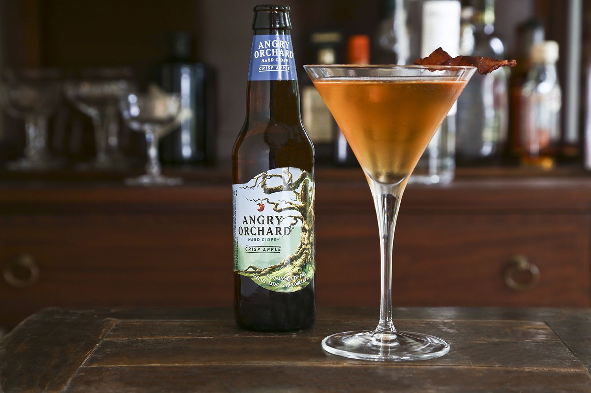

image source [here](https://www.thespruceeats.com/unique-cocktails-for-adventurous-drinkers-759874)

Unusual flavor combinations that actually work in drinks. Be sure to test them yourself!

|Name| Primary Alcohol | How to make | 
|---| ---| ---| 
| Bacon Me Angry | Vodka | [recipe](https://bacontoday.com/2015/01/19/bacon-me-angry-angry-orchard-cocktail/)|
| Butternut Old Fashioned | Whiskey | [recipe](https://www.thespruceeats.com/little-doms-butternut-old-fashioned-recipe-761338)|
| Coconut Martini | Vodka | [recipe](https://www.thespruceeats.com/coconut-martini-recipe-759080)|
| Eucalyptus Martini | Gin | [recipe](https://www.thespruceeats.com/eucalyptus-martini-recipe-760078)|
| Jungle Bird | Rum | [recipe](https://www.thespruceeats.com/jungle-bird-cocktail-4687092)|
| Ruby Queen | Vodka | [recipe](https://www.thespruceeats.com/ruby-queen-cocktail-recipe-759220)|
| The Beer, Bourbon & Barbecue Cocktail | Whiskey | [recipe](https://www.thespruceeats.com/beer-bourbon-and-barbecue-cocktail-recipe-4156984)|

For more details don't forget to check [this](https://www.thespruceeats.com/unique-cocktails-for-adventurous-drinkers-759874) out!

### Take it slow and try an alcohol-free cocktail

If you are not in the mood for alcohol, be sure to try these non-alcoholic cocktails. We are sure that they'll surprise you!

|Name| Difficulty | How to make | 
|---| ---| ---|
| Blueberry Maple Mojito | Easy | [recipe](https://www.healthyrecipeecstasy.com/blueberry-maple-mojito-mocktal-gender-reveal/) |
| Citrus Strawberry Mocktail | Easy | [recipe](https://www.playpartyplan.com/citrus-strawberry-mocktail-recipe) |
| Chai Blossom | Easy | [recipe](https://www.bonappetit.com/recipe/chai-blossom) |
| Drivers' punch | Easy | [recipe](https://www.bbcgoodfood.com/recipes/drivers-punch) |
| Moscow Mule Mocktail | Easy | [recipe](https://themerrythought.com/diy/moscow-mule-mocktail/) |
| New York Sour Mocktail | Easy | [recipe](https://www.bbcgoodfood.com/recipes/new-york-sour-mocktail) |
| Pear & Rose Punch | Easy | [recipe](https://www.bbcgoodfood.com/recipes/pear-apple-rose-punch) |
| Pinapple & Lime Mocktail | Easy | [recipe](https://www.bbcgoodfood.com/recipes/shine-light) |
| Pomegranate Mojito Mocktail | Easy | [recipe](https://www.bbcgoodfood.com/recipes/pomegranate-mojito-mocktail) |
| Popsicle Punch | Easy | [recipe](https://www.delish.com/cooking/recipe-ideas/a22805581/popsicle-punch-recipe/) |
| Raw Raspberry Shrub | Easy | [recipe](https://www.bbcgoodfood.com/recipes/raw-raspberry-shrub) |
| Shirley Temple | Easy | [recipe](https://www.delish.com/cooking/recipe-ideas/a29813919/shirley-temple-drink-recipe/) |
| Summer Cup Mocktail | Easy | [recipe](https://www.bbcgoodfood.com/recipes/summer-cup-mocktail) |

Image source: https://www.talkingretail.com/products-news/alcohol/new-formula-1-campaigns-heineken-09-09-2016/

---

## Coding Projects

### **Python**

* Rock, Paper, Scissors Game

A simple python program to test your skills. Try developing it as a player vs computer game in the beginning. Skills used: Learn how to use while loops and if statements

* Build a Twitter Bot

You can make a program that helps you engage your audience while studying or working on other projects! You will have to sign up as a Twitter developer, but don't worry, it is not that difficult.

* Alarm Clock

Creating an alarm clock is a cool way of demonstrating your coding skills. To begin with, create a program that sends a notification at a designated time. Afterwards, you can add functionality, like music or videos.

* Typing Test

Create a python program with a complete GUI, that gives you a random sentence, and tests your typing speed. It is an advanced project but you can learn a lot about design.

Source : https://careerkarma.com/blog/python-projects-beginners/

### **Java**

* Temperature Converter Tool

This is a simple project to help you practice your Java skills. It just requires the basic mathematic skills that will help you build the logic of the program. 
Tip: you can use the javafx package to build the tools interface.

* Percentage Calculator

This is another great project to help you develop your coding skills and it uses basic Java concepts. The user just inserts the value and the calculator returns the matching percentage.
The javafx package will help you build the interface.

* Laboratory Management System

Java Project Idea: The laboratory management system is another exciting beginner level project that is used to provide security of the data of the laboratory. Access permissions for viewing and updating the data are set for each entity. There are three entities in this system.

The Admin maintains database of laboratory and can retrieve data from the database using oracle and solves the technical problems if it occurs by using technologies like Java servlets and JSP using the tomcat server.

The Faculty can post and update marks of students and can provide notices and latest updates related to tasks, like date of task submission, dates of lab examinations. Faculty also generates the report.

Students are the main users of this system. Their attendance is updated whenever they login to the system. The student has only permission to view the notices and updates.

* Stadium Seat Booking System

Java Projects Idea: This is another automated system that can be developed in Java and will be useful to the people for booking their seats in the stadium through the online method. Every detail of the stadium should be mentioned properly including the number of seats, seat availability, price of the seat, category of seats.

Admin will manage all the details related to the stadium and matches that would take place in the stadiums and will have to update each detail. When the user books a seat, he will get a unique seat number.

This application will require a robust database as it would contain the details of all the matches taking place in a particular region.

* Color Hunt Gaming Project

Java Project Idea: Color hunt is an entertaining mind game which consists of letters with different colors arranged randomly on it. In this Java game, we mention a statement of a precise color and letter, which we’re supposed to click in the block box as fast as we can. We need to click on the exact color which has been mentioned and the statement immediately keeps changing.

* I-card generator system

Java Project Idea: As the name suggests, the I-Card Generator System will help in smoothly generating the identity cards for the employees of any organization or for the students and teachers of the educational institutes with great ease.

The admin will add all the relevant details to be shown on the id card like photograph, name, age, department, year of joining, blood group, address, mobile number. And the system will generate the id card based on these details. The system will ensure that only one ID card is generated for a person. This project will prove to be one of the unique and interesting core Java projects to be opted for and to Java expertise in your profile.

Source: https://data-flair.training/blogs/java-project-ideas/

### **React**

* Realtime Chat App

Real-world examples: Slack, Messenger, Discord, Crisp Chat

All of us use some kind of a realtime chat app in our daily life, you can also experiment with creating a widget within a website so that customers can directly talk to the site owners.

All chat apps allow users to send messages in real-time, to react to messages and to show when a user is online or offline.

> How to build a realtime chat app:
> * Build your project with create-react-app or Next.js
> * Use a service like Firebase or GraphQL subscriptions for messages
> * Add reactions to message with emoji with the npm package emoji-mart
> * Deploy to the web using Firebase Tools

* Social media app

It is similar to a chat app, but with a larger community of users and wider functionality. The users can interact in different ways. They can follow one another, add media to share with others, and interact with liking or commenting posts.

> How to build a social media app:
> * Build the frontend with create-react-app and the backend using Node API
> * For a database, use Postgres or MongoDB, alongside an ORM like Prisma or Mongoose
> * Use social authentication using Passport or a simpler service like Auth0
> * Deploy backend to Heroku, frontend to Netlify

* Video Sharing app

Real-world examples: Youtube, TikTok, Snapchat

One of the most broad categories of apps, that can be integrated in a site like Youtube with a browser to search for videos or like a messaging app eg. Snapchat.

> How to build a video sharing app:
> * As you might know by now, use create-react-app and Node
> * Use Cloudinary for image and video uploads to the Cloudinary API
> * Use Postgres or MongoDB
> * Deploy to Heroku, frontend to Netlify

* Music Streaming App

React applications are perfect for streaming video content, as well as music. Music apps have a similar structure to video sharing apps and they may or may not allow the user to upload their own music. You can listen to a song, comment on it, or even purchase it. Try to combine elements of a video sharing service and of an e-commerce app.

Source : https://www.freecodecamp.org/news/react-projects-you-should-build-this-year/

---

## Cooking
Enjoy different kind of meals from around the world!

In the following table, you can view recipes from different countries, along with the recommender’s  personal rating.

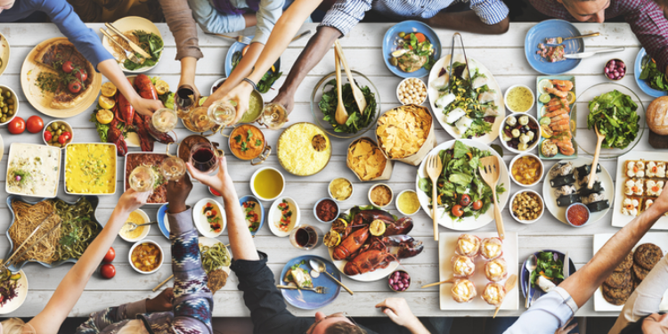

Photo owned by [Shutterstock.com](https://www.shutterstock.com/de/image-photo/brunch-choice-crowd-dining-food-options-384205462)

|DISH| ORIGIN| MY RATING| RECIPE| PRO-TIP|
|---| ---| ---| ---| ---|
| Avocado Brownies | Universal | 10/10 | [Link](https://akispetretzikis.com/el/categories/keik/brownies-me-avokanto "How to make avocado brawnies") | Pick a ripe avocado. |
| Banana Split | U.S.A. | 10/10 | [Link](https://www.tasteofhome.com/recipes/all-american-banana-split/) | Mix up the original recipe by adding different kinds of fruit. |
| Banoffee | England | 10/10 | [Link](https://akispetretzikis.com/en/categories/glyka/banoffee/) | Transform it into a chocolate banoffee by adding some chocolate couverture in the caramel mixture!|
| Brownies | U.S.A. | 10/10 | [Link](https://akispetretzikis.com/el/categories/keik/brownies)| Do not hesitate to serve with a scoop of vanilla ice cream. |
| Burrito | Mexico | 10/10 | [Link](https://akispetretzikis.com/el/categories/snak-santoyits/burrito) | Add chili sauce to make it spicy.
| Cheesecake | Ancient Greece | 10/10 | [Link](https://sugarspunrun.com/best-cheesecake-recipe/) | Serve with sweet apple preserve. |
| Chocolate chip cookies | U.S.A. | 10/10 | [Link](https://www.tasteofhome.com/recipes/big-buttery-chocolate-chip-cookies/) | Use pecans instead of walnuts. |
| Cupcakes| Universal| 10/10 | [Link](https://sallysbakingaddiction.com/super-moist-chocolate-cupcakes/) | Make sure you’re using natural unsweetened cocoa powder, not dutched cocoa.|
| Egg fried rice | U.S.A. | 10/10 | [Link](https://www.bbcgoodfood.com/recipes/oriental-egg-fried-rice) | Consider adding chicken. |
| Feta Pasta Challenge | Universal | 10/10 | [Link](https://www.youtube.com/watch?v=WRzQ-Ngt3Do) | Serve with olives. |
| Greek Salad | Greece | 10/10 | [Link](https://www.loveandlemons.com/greek-salad/) | Add capers to gain maximum taste. |
| Handmade Cinnamon Rolls | Northern Europe | 10/10 | [Link](https://www.youtube.com/watch?v=_Q0FYoCl4Cs) | Serve with extra cinnamon. |
| Italian Pizza | Italy | 10/10 | [Link](https://www.walksofitaly.com/blog/food-and-wine/italian-pizza-dough-recipe) | Keep it simple on the ingredients! |
| Lemon Pound Cake Loaf | England | 10/10 | [Link](https://www.seasonsandsuppers.ca/glazed-lemon-pound-cake-loaf/)| You can freeze it and grab a slice whenever you crave it! |
| Lemon Rice | India | 9/10 | [Link](https://www.feastingathome.com/indian-lemon-rice/) | Serve it with fish. |
| Lentil Soup | Morocco | 10/10 | [Link](https://www.simplyquinoa.com/detox-moroccan-lentil-soup/) | Serve with fresh onions. |
| Light Spaghetti Souffle | Italy | 10/10 | [Link](https://akispetretzikis.com/en/categories/zymarika/light-soyfle-me-makaronia-ston-foyrno/) | Mix the spaghetti and heavy cream with the turkey, mushrooms and corn for an even more delicious outcome! |
| New York-Style Pizza | U.S.A. | 10/10 | [Link](https://www.tasteofhome.com/recipes/new-york-style-pizza/) | Reheat in the oven. |
| Onion Rings | U.S.A. | 10/10 | [Link](https://www.tasteofhome.com/recipes/crispy-fried-onion-rings/) | Serve with different kinds of sauce. |
| Pancakes | Universal | 10/10| [Link](https://akispetretzikis.com/en/categories/glyka/pancakes "How to Make Pancakes")|  Flip when the small bubbles appear. |
| Parmesan Chicken | Italy | 10/10 | [Link](http://www.itscheatdayeveryday.com/one-pan-parmesan-tuscan-chicken/) | Serve with brown rice. |
| Pasta Primavera | Italy | 10/10 | [Link](https://www.cookingclassy.com/pasta-primavera/) | Mix up the veggies to create different combinations. |
| Pasta Salad | Italy | 10/10 | [Link](https://carlsbadcravings.com/italian-pasta-salad/) | Experiment with different kinds of pasta. |
| Pastitsio | Greece | 10/10| [Link](https://akispetretzikis.com/en/categories/zymarika/to-pastitsio-toy-akh "How to Make Pastitsio")|It's all about the Bechamel sauce. |
| Penne Arrabiata | Italy | 10/10 | [Link](https://www.aline-made.com/penne-arrabiata/) | Serve with parmesan. |
| Soft Cookies| Universal | 10/10 | [Link](https://www.youtube.com/watch?v=K-YHpNU0Dbk) | Serve with milk. |
| Sushi | Japan | 10/10| [Link](https://akispetretzikis.com/en/categories/ryzi-amp-patates/soysi "How to Make Sushi")| Experiment with different types of fish. |
| Sweet & Sour Chicken | China | 10/10 | [Link](https://www.bbcgoodfood.com/recipes/sweet-sour-chicken) | Serve with rice. |
| Tacos | Mexico | 10/10 | [Link](https://www.thewholesomedish.com/the-best-homemade-tacos/) | Add extra cheese!! |
| Tzatziki | Greece | 10/10| [Link](https://cookieandkate.com/how-to-make-tzatziki/ "How to Make Tzatziki")| Choose a creamy yoghurt to create the perfect spread! |

### Check out some healthy alternatives

It is very important to eat healthily in a daily basis so that we give our body the energy it deserves to get us through our everyday obligations. These recipes are proof that healthy can be very tasty!

|DISH|RECIPE| PRO-TIP|
|---| ---| ---|
| Banana Bread| [recipe here](https://www.youtube.com/watch?v=zYHYrkdVQ38)| Do not forget to include some extra choco chips|
| Banana Oatmeal Pancakes| [recipe here](https://www.youtube.com/watch?v=y8kvazx1C6I)| Serve with honey and blueberries|
| Berry Smoothie Bowl| [recipe here](https://www.youtube.com/watch?v=b_h0-IHvvAw)| Add peanut butter as a topping|
| Greek Chicken Grain Bowl| [recipe here](https://www.goodhousekeeping.com/food-recipes/a35353557/greek-chicken-grain-bowl-recipe/)| Enjoy!|
| Healthy Chocolate Cupcakes | [recipe here](https://www.youtube.com/watch?v=_Oe_EGO9xsc)| Go crazy on the decoration|
| Healthy Salted Caramel Popcorn| [recipe here](https://laurenslatest.com/healthy-caramel-corn/)| Enjoy them!|
| Special Overnight Oats 5 ways| [recipe here](https://www.youtube.com/watch?v=3uiaaiugNdE&t=314s)| Best combo is choco & PB|

### Make sure you don't skip breakfast

Breakfast is known as one of the most important meals of the day, if not the most important, as many suggest. It boosts your energy levels and improves your ability to concentrate, while refueling your body with vital nutrients. To sum up, breakfast helps both your brain and body to stay alert during your rough daily routine. 

So, why do you keep skipping it? Quarantine is the perfect time to adopt new habits and you have to add breakfast in your everyday list!

In order to convince you that breakfast is not always a time-consuming process, here is a list of easy-to-make and interesting breakfast ideas:

| DISH| RECIPE| COOKS IN| DIFFICULTY|
|---| ---| ---| ---|
| Anglo-French Toast| [recipe](https://www.jamieoliver.com/recipes/bread-recipes/anglo-french-toastie/)| 20 minutes| Super easy|
| Chocolate & Banana French Toast| [recipe](https://www.jamieoliver.com/recipes/french-toast-recipes/chocolate-banana-french-toast/)| 15 minutes| Not too tricky|
| Fluffy Flourless Pancakes| [recipe](https://www.jamieoliver.com/recipes/breakfast-recipes/fluffy-flourless-pancakes/)| 10 minutes| Not too tricky|
| Ham, Cheese and Avocado Sandwich| [recipe](https://akispetretzikis.com/en/categories/snak-santoyits/tost-me-avokanto-tyri-kai-zampon/)| 10 minutes| Super easy|
| Marmalade French Toast Sandwiches| [recipe](https://www.tasteofhome.com/recipes/marmalade-french-toast-sandwiches/)| 15 minutes| Not too tricky|
| Peanut Butter Oatmeal| [recipe](https://www.tasteofhome.com/recipes/peanut-butter-oatmeal/)| 15 minutes| Easy|
| Porridge| [recipe](https://akispetretzikis.com/en/categories/snak-santoyits/porridge)| 10 minutes| Easy|
| Simple Cheese Omelette| [recipe](https://www.jamieoliver.com/recipes/eggs-recipes/simple-cheese-omelette/)| 10 minutes| Super easy|

---

##  Covid-19 Infection

### What should we do if someone is infected from covid?

**FIRST RULE: DON'T PANIC!**

#### Stay home except from when you need medical care
1. Inform you personal doctor! In case you don't have a personal doctor, call someone you know and you can trust and contact someone that can help you get the right treatment.
2. Stay home!
3. Take care of yourself.
4. Stay in touch with your doctor.
5. Avoid public transportation.
6. Separate yourself from other people (its bad but not forever!!).
7. Monitor your symptoms.
8. Call ahead before visiting your doctor.
9. Avoid sharing personal household items.
10. Clean your hands often.
11. Cover your coughs and sneezes.
12. Wear a mask over your nose and mouth.
13. Get Tested!!! It is important to repeat a positive test, in order to ensure that you got better.
14. Clean all “high-touch” surfaces everyday!

Information was taken from [here.](https://www.cdc.gov/coronavirus/2019-ncov/if-you-are-sick/steps-when-sick.html)

---

##  **Discover Space**

A lockdown can cause a sudden increase in leisure and boredom at the same time. So, why not take advantage of this time to discover many aspects of the world that can cause awe and the feeling of how small and fragile we are in this world, and killing our boredom.

### **What is space?**
Space is the boundless three-dimensional extent in which objects and events have relative position and direction. Physical space is often conceived in three linear dimensions, although modern physicists usually consider it, with time, to be part of a boundless four-dimensional continuum known as spacetime. 

Source: [https://en.wikipedia.org/wiki/Space](https://en.wikipedia.org/wiki/Space)

### **Dark Matter and Dark Energy**

Dark matter is an undiscovered yet matter way different from the normal matter or anti-matter, that interact with gravity and doesn't reflect any light, so, as a result, it is, also, invisible and that's why it's called 'Dark' matter. 

 Its presence is implied in a variety of astrophysical observations, including gravitational effects, that cannot be explained by accepted theories of gravity, unless more matter is present than can be seen. For this reason, most experts think that dark matter is abundant in the universe and that it has had a strong influence on its structure and evolution.

 Primary evidence for dark matter comes from calculations, showing that many galaxies would fly apart, or that they would not have formed or would not move as they do, if they did not contain a large amount of unseen matter.

 Source: [https://en.wikipedia.org/wiki/Dark_matter](https://en.wikipedia.org/wiki/Dark_matter)

Click **here** for a tutorial:
- [here](https://www.youtube.com/watch?v=QAa2O_8wBUQ)
- [here](https://www.youtube.com/watch?v=2gWzwG1KNe8)

### **Big Bang**

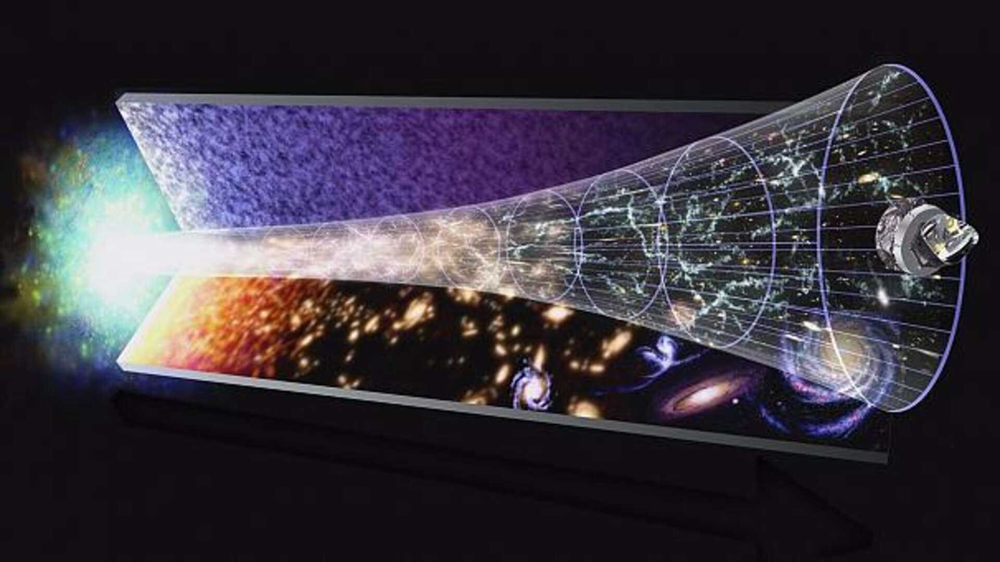

Source: [https://www.esa.int/ESA_Multimedia/Videos/2014/05/ESA_Euronews_Echoes_from_the_Big_Bang](https://www.esa.int/ESA_Multimedia/Videos/2014/05/ESA_Euronews_Echoes_from_the_Big_Bang)

Big Bang theory is a cosmology theory, that try to explain from where the universe and the all the matter came from and how they have been created. In particular, the theory mentions that 13.8 billion years ago, a huge explosion, bigger than anything else in history, took place and became the start of the universe creation and the creation of matter.

Much research has been carried out, in order to prove the Big Bang theory true, with the most valuable of them being this of Edwin Hubble, who has found that galaxies are moving apart from one another in a way that fits previous predictions with the help of Hubble telescope.

While the majority of the astronomical community accepts the theory, there are some theorists who have alternative explanations besides the Big Bang — such as eternal inflation or an oscillating universe.

Click **here** for tutorials:
- [here](https://www.youtube.com/watch?v=wNDGgL73ihY&ab_channel=Kurzgesagt%E2%80%93InaNutshell)
- [here](https://www.youtube.com/watch?v=0zyWy9JPPtc&ab_channel=Astronio)

### **Solar Stroms**

Source: [http://www.bbc.com/earth/story/20150923-the-sun-creates-space-weather-that-affects-us-all?referer=https%3A%2F%2Fwww.google.gr%2F&referer=https%3A%2F%2Fwww.google.gr%2F&referer=https%3A%2F%2Fwww.google.gr%2F&referer=https%3A%2F%2Fwww.google.gr%2F](http://www.bbc.com/earth/story/20150923-the-sun-creates-space-weather-that-affects-us-all?referer=https%3A%2F%2Fwww.google.gr%2F&referer=https%3A%2F%2Fwww.google.gr%2F&referer=https%3A%2F%2Fwww.google.gr%2F&referer=https%3A%2F%2Fwww.google.gr%2F)

Solar strom is a common phenomenon that the sun vomit's million tons of plasma and radiation in random destinations, known as Coronal Mass Ejections (CME). A simple solar storm doesn't affect the earth, because atmosphere works as a filter to such waves, but if the wave is too big, then the wave will affect the global communication system and all the devices that use electricity will be out of order. Although this effect affects the earth twice in a century, the mechanics know how to protect the system.

Click **here** for tutorial:
- [here](https://www.youtube.com/watch?v=oHHSSJDJ4oo&ab_channel=Kurzgesagt%E2%80%93InaNutshell)

### **Black Holes**

Source: [https://phys.org/news/2021-01-extreme-black-holes-hair.html](https://phys.org/news/2021-01-extreme-black-holes-hair.html)

   #### How they are created and what are they
   A black hole is an extremely dense astronomical object from which nothing can escape, not even light. When a star explodes in a supernova, a black hole can be left behind. Alternatively, a supermassive star can burn through its fuel quickly and turn into a black hole, no explosion needed.

   According to Einstein's theory of special relativity, nothing can travel faster through space than the speed of light. This means a black hole's event horizon is essentially the point from which nothing can return. The name refers to the impossibility of witnessing any event taking place inside that border, the horizon beyond which one cannot see. 
   
   "The event horizon is the ultimate prison wall — one can get in but never get out," Avi Loeb, chair of astronomy at Harvard University, told Space.com.

   Source:
   - [https://www.nasa.gov/feature/goddard/2019/birth-of-massive-black-holes-in-the-early-universe-revealed](https://www.nasa.gov/feature/goddard/2019/birth-of-massive-black-holes-in-the-early-universe-revealed)
   - [https://www.space.com/black-holes-event-horizon-explained.html](https://www.space.com/black-holes-event-horizon-explained.html)

   Click **here** for tutorials:
   - [here](https://www.youtube.com/watch?v=e-P5IFTqB98)
   - [here](https://www.youtube.com/watch?v=nz4mOCRveP8)
   - [here](https://www.youtube.com/watch?v=ulCdoCfw-bY&ab_channel=Kurzgesagt%E2%80%93InaNutshell)
   - [here](https://www.youtube.com/watch?v=zdKAM5E9gWk)

   #### **How big can they get? (Supermassive Black Holes)**

   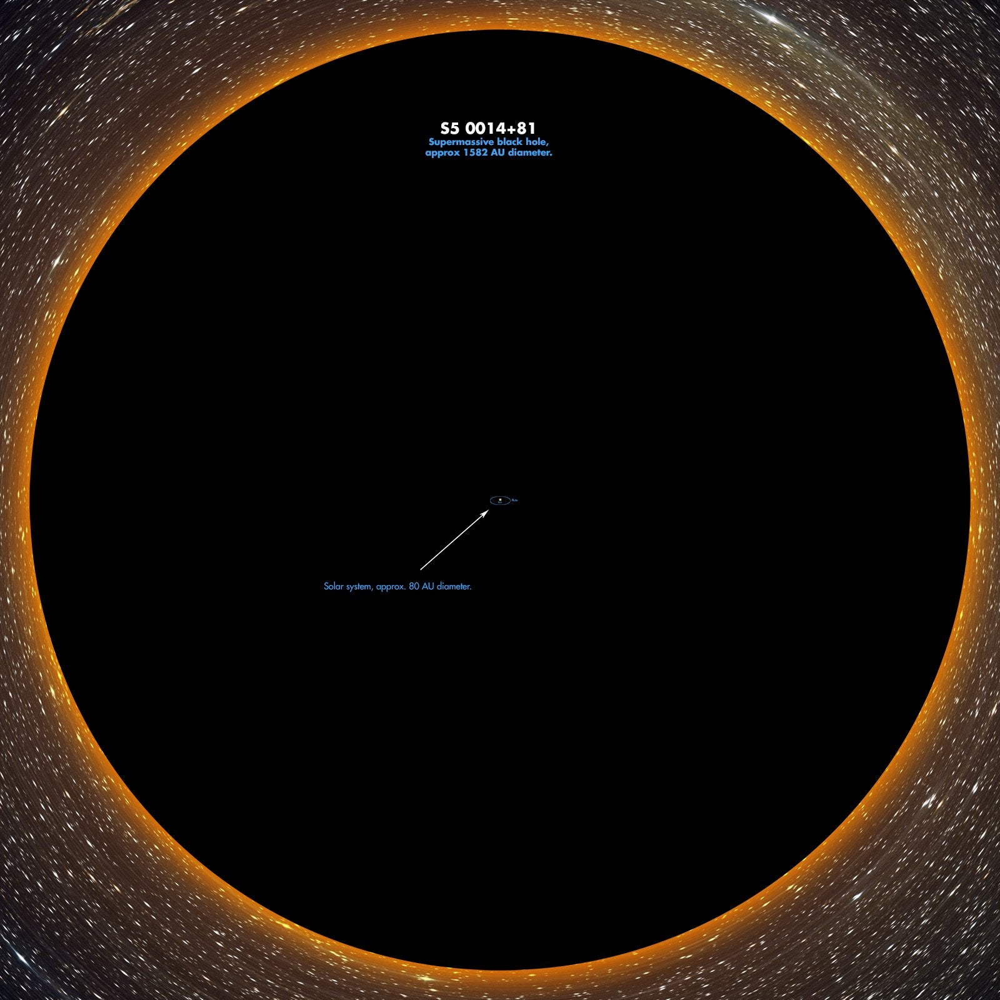

   Source: [https://www.reddit.com/r/space/comments/5qkole/s5_001481_the_largest_known_supermassive_black/](https://www.reddit.com/r/space/comments/5qkole/s5_001481_the_largest_known_supermassive_black/)

   Actually the size of a black hole has no possible limit (although scientists support that it can't exist a black hole with 50 bln times the mass of our sun). The more matter it swallows, the bigger it can get. The easiest way for a black hole to grow is by swallow another black hole. In result, a new black hole will be created with both their masses and with unbelievable  gravitational power. In order to understand this better, in the above photo the dat in the center of the black hole, is how big is our solar system in front of this supermassive black hole..

   Click **here** for tutorial:
   - [here](https://www.youtube.com/watch?v=yWO-cvGETRQ)
   - [here](https://www.youtube.com/watch?v=7WtrAuNnXKI)

   #### **Travel inside a Black Hole & Wormholes**

   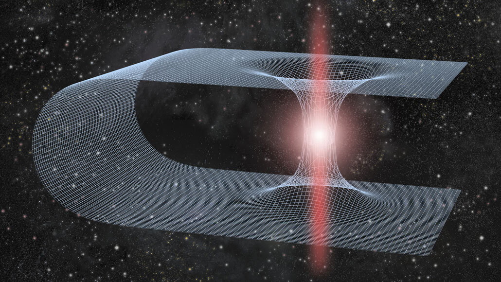

   Source: [https://www.sciencenewsforstudents.org/article/could-spacetime-ripples-point-at-wormholes](https://www.sciencenewsforstudents.org/article/could-spacetime-ripples-point-at-wormholes)

   The most obvious thing that everyone would imagine that might happen inside a black hole is complete destruction. Actually, Einstein with the relativity theory changed completely the way that we perceive black holes. If matter is capable of bending the time and space, then the black hole, which is the most amount of matter that can be located in a single spot, is doing the biggest den in spacetime. Therefore, if spacetime dimension is like a paper that is folded, the black hole is like a tube that unites the two surfaces. By entering a black hole, you will travel to another location of the universe, where you will be spit out from a white hole, like a detour. Although, neither white hole nor wormhole have been found, they exist only in theory.

   Click **here** for tutorial:   
   - [here](https://www.youtube.com/watch?v=9P6rdqiybaw)

   #### **Gamma Ray burst (Quazars)**

   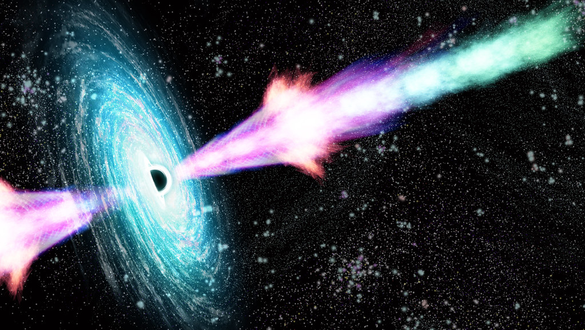
   
   Source: [https://www.efreenews.com/a/are-gamma-ray-bursts-powered-by-a-star-s-collapsing-magnetic-fields](https://www.efreenews.com/a/are-gamma-ray-bursts-powered-by-a-star-s-collapsing-magnetic-fields)

   When a massive star in a distant galaxy collapses, forming a black hole, two giant jets of light-emitting plasma shoot from its core. These extremely bright gamma-ray bursts (GRBs) are the most powerful explosions in the universe, and when a jet points towards Earth, the afterglow can be detected from ground and space-borne telescopes. Material does not simply catapult from an exploding star, it accelerates to ultra-high speeds along the narrow beam of the gamma-ray jet, leaving astrophysics puzzled over the power source driving these extraordinary explosions.

   source: [https://www.efreenews.com/a/are-gamma-ray-bursts-powered-by-a-star-s-collapsing-magnetic-fields](https://www.efreenews.com/a/are-gamma-ray-bursts-powered-by-a-star-s-collapsing-magnetic-fields)

   click **here** for some tutorials:
   - [here](https://www.youtube.com/watch?v=RLykC1VN7NY)
   - [here](https://www.youtube.com/watch?v=jVHnVcZ6YMQ)
   - [here](https://www.youtube.com/watch?v=PPlrtgilgK8)

### Neutron Stars

Source: [https://www.sciencephoto.com/media/814141/view/neutron-star-artwork](https://www.sciencephoto.com/media/814141/view/neutron-star-artwork)

When the core of a massive star undergoes gravitational collapse at the end of its life, protons and electrons are literally scrunched together, leaving behind one of nature's most wondrous creations: a neutron star. Neutron stars cram roughly 1.3 to 2.5 solar masses into a city-sized sphere perhaps 20 kilometers (12 miles) across. Matter is packed so tightly that a sugar-cube-sized amount of material would weigh more than 1 billion tons, about the same as Mount Everest!

Most known neutron stars belong to a subclass known as pulsars. These relatively young objects rotate extremely rapidly, with some spinning faster than a kitchen blender. They beam radio waves in narrow cones, which periodically sweep across Earth like lighthouse beacons. But as GLAST Project Scientist Steve Ritz of NASA Goddard points out, "With magnetic fields trillions of times stronger than Earth's, pulsar magnetic fields are high-energy particle accelerators." The magnetospheres of some pulsars, accelerate particles to such high energies that they are relatively bright gamma-ray sources.

Source: [https://www.nasa.gov/mission_pages/GLAST/science/neutron_stars.html](https://www.nasa.gov/mission_pages/GLAST/science/neutron_stars.html)

Click **here** for tutorial:
- [here](https://www.youtube.com/watch?v=udFxKZRyQt4&t=27s)

---

## Down the rabbit hole

##### Below, lies a list of conspiracy theories that are notable. Feel free to further investigate, you can find further information and videos on Youtube and Google. Some could be and turn out to be true, but most of these conspiracies seem impossible to believe, but it is still very interesting, to analyze why some groups of people decide to not only follow these beliefs but also promote them.

* __MKUltra__

Genuine American research in the 1950s and 1960s into drug-induced interrogation and mind-control techniques were followed by many conspiracy theories(eg. Project Monarch), especially following CIA Director Richard Helm's 1973 order to destroy anything related to the project. One of these theories, is the allegation that the mass fatality at Jonestown in 1978 was connected to an MKUltra experiment.

The intent of the project was to study “the use of biological and chemical materials in altering human behavior,” according to the official testimony of CIA director Stansfield Turner in 1977.

Under MKUltra, the CIA gave itself the authority to research how drugs could: “promote the intoxicating effects of alcohol;” “render the induction of hypnosis easier;” “enhance the ability of individuals to withstand privation, torture and coercion;” produce amnesia, shock and confusion; and much more. Many of these questions were investigated using unwitting test subjects, like drug-addicted prisoners, marginalized sex workers and terminal cancer patients–”people who could not fight back,” in the words of Sidney Gottlieb, the chemist who introduced LSD to the CIA.

Image Source : https://www.theguardian.com/tv-and-radio/shortcuts/2016/aug/15/netflix-stranger-things-project-mkultra

* __Flat Earth__

Flat Earth theory first emerged in 19th-century England, despite the Earth's spherical nature having been known since at least the time of Pythagoras. Lately, it has been promoted by American software consultant Mark Sargent through the use of YouTube videos. Flat-earther conspiracy theorists believe that planet Earth is not a sphere, and that evidence has been faked to hide the fact that is instead a disc, or a single infinite plane. The conspiracy often implicates NASA. Other claims include that GPS devices are rigged to make aircraft pilots wrongly believe they are flying around a globe.

Image Source : https://theconversation.com/flat-earthers-vs-climate-change-sceptics-why-conspiracy-theorists-keep-contradicting-each-other-96060

* __Weather and earthquake control projects__

Many theories pertain to real or alleged weather-controlling projects. Theories include the debunked assertion that HAARP, a radio-technology research program funded by the US government, is a secret weather-controlling system. Some theorists blamed HAARP for 2005's Hurricane Katrina. HAARP has also been suggested to have somehow caused earthquakes, such as the 2011 Tōhoku earthquake and tsunami, the 2013 Saravan earthquake or the 2010 Haiti earthquake. Some HAARP-related claims refer to mind-control technology.

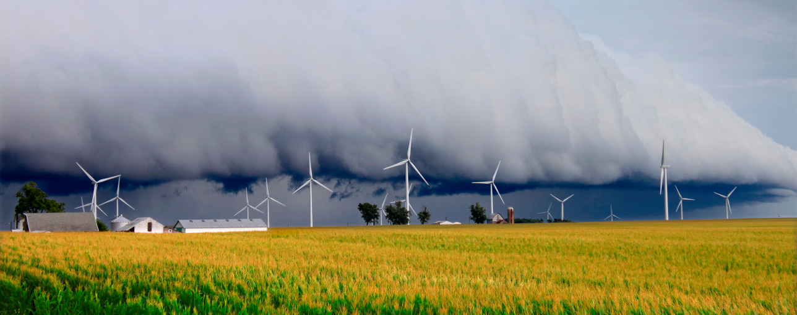
Image Source : https://www.dnv.com/news/reducing-cyclone-and-earthquake-challenges-for-wind-turbines-144220

* __Area 51__

The famous Area 51 in the Nevada desert is a military installation at the Nelli's Military Operations Area. But the base quickly became known as the most secretive military site in the world because it does not exist on any map or government website, leading many to craft conspiracy theories.

Some believe Area 51 is researching and experimenting on aliens and their spacecraft. More specifically, people think they are studying a crash that happened near Roswell, New Mexico, in 1947. Others theorize that the moon landing was staged at Area 51.

The government has said the facility is used to test experimental aircraft for the military.

Image Source : https://theconversation.com/flat-earthers-vs-climate-change-sceptics-why-conspiracy-theorists-keep-contradicting-each-other-96060

* __QAnon__

QAnon is a baseless far-right conspiracy theory that claims President Donald Trump is secretly fighting a "deep state" cabal of satanic pedophiles and cannibals.

The conspiracy theory dates back to 2017 when a supposed high-level government official posted details of the inner workings of the government on the anonymous messaging board 4chan. The person identified themselves simply as "Q." From there, the far-right group of people known as QAnon was born. 

While QAnon started as a niche online forum, it has turned into a mainstream belief system for some conservatives, according to The Washington Post. 

However, the claims within the conspiracy theories are not supported by evidence.

Image Source : https://www.nature.com/articles/d41586-021-00257-y

* __Alaska mind control__

In the mountains of Alaska, you can find the High-Frequency Active Auroral Research Program that helps scientists study the farthest distances of the atmosphere. The facility sits on 33 acres of land and has over 180 antennas. The antennas have collected data about the aurora borealis, radio waves, and other atmospheric occurrences.

But some think the antennas are an experimental weapon that can control people's minds, according to the Smithsonian. Others believe it caused the Columbia space shuttle to destruct in 2003. In 2016, however, the facility held an open house so the public could see that they were not up to anything dangerous.

* __Malaysia Airlines Flight MH370__

The disappearance of Malaysia Airlines Flight 370 in southeast Asia in March 2014 has prompted many
theories. One theory suggests that this plane was hidden away and reintroduced as Flight MH17 later the same
year in order to be shot down over Ukraine for political purposes. Prolific American conspiracy theorist James
H. Fetzer has placed responsibility for the disappearance with Israeli Prime Minister Benjamin Netanyahu.

Image Source : https://www.bbc.com/news/magazine-26609687

* __Chemtrails__

Also known as SLAP (Secret Large-scale Atmospheric Program), this
theory alleges that water condensation trails ("contrails") from aircraft
consist of chemical or biological agents, or contain a supposedly toxic
mix of aluminum, strontium and barium, under secret government
policies. An estimated 17% of people globally believe the theory to be
true or partly true. In 2016, the Carnegie Institution for Science published
the first-ever peer-reviewed study of the chemtrail theory; 76 out of 77
participating atmospheric chemists and geochemists stated that they had
seen no evidence to support the chemtrail theory, or stated that chemtrail
theorists rely on poor sampling.

Image Source : https://www.scientificamerican.com/article/what-are-chemtrails-made-of/

Source : https://en.wikipedia.org/wiki/List_of_conspiracy_theories

---
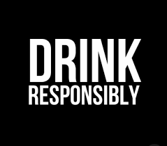

## Drinking Games
Drinking games offer the opportunity to come closer with your friends and have a a great time **(Drink responsibly).**
* **Flip cup:** This is a team game, where two opposing groups stand on opposite sides of a table or counter, with a full cup in front of each player.
The games begin, and the first players in line race to down their drinks, and then place their empty cups upside down on the edge of the surface. They then have to successfully flip their cups the right way up – not so easy once you've had a few – at which point the next player in line has to do the same. It's a relay, so the first team to get to the end wins!\
*What you need: Large plastic cups(can also be used for [beerpong](#beerpong))*
* **Drunk Jenga:** Buy a jenga set (there are loads of cheap ones on [Amazon](https://www.amazon.com/Jenga-A2120EU4-Classic-Game/dp/B00ABA0ZOA?ref_=ast_sto_dp&th=1&psc=1)), and write a different rule on the top of each wooden block. Things like 'drink two fingers of your drink 'or 'have a shot'. The more you play, the drunker you'll get, and the more clumsy your game will be.\
*What you need: A jenga set.*
* **Back to back:** Two people in your group stand back to back, drinks in hand. The rest of the group ask them a 'Who's the most likely to....' question, and which ever member thinks they're the most likely to, drinks. If one of them drinks, you ask the next question. If they both drink, they both have to drink again. If neither of them drink, they also both have to drink again.\
*What you need: Only your drinks.*
*  **Beerpong:** Beerpong is an all-around crowd pleaser, because it’s easy to follow, however difficult to master. To play this team drinking game lay out two sets of cups forming a pyramid on both ends of the table, gather a ping pong ball and fill the cups with your drink of choice. The teams then take it in turns to throw the ball into the other team’s cups. If you get the ping pong ball into your opponent’s cup, they have to drink its contents.\
*What you need: Large cups and a pingpong ball(maybe more than one).*
* **Ring of Fire:** This is an exciting drinking game that is played using playing cards. The player must drink and pass round the drinks based on the card drawn. [Each card has a rule that is established before the start of the game](https://ringoffirerules.com/). Every player picks a card and does what the card represents, and it can be anything from choosing someone to take a drink to start a game of categories. When a player draws a king, he pours a quarter of what he is drinking into the middle cup. The game comes to an end when the last king is drawn. The player who draws the last King has to drink the concoction in the King’s cup to the last drop.\
*What you need: A deck of cards.*
* **Never Have I Ever:** This is an awesome drinking game to get to know your drinking partners better. Everyone needs a drink and their memory to be sharp. Players take turns calling experiences they have never had. Anyone that has had the called experience has to take a sip of their drink. Be careful though! Crazy people will probably get drunk quickly while the shier ones stay sober.\
*What you need: Your drinks and a good mood.*
* **Impostor:** Fill all the shot glasses with water and just one with vodka. Then, place the glasses on a circular rotating surface and gather around it. As the surface rotates close your eyes in order to forget the position of the vodka glass. When the surface stops spinning, players begin to drink the shot glass in front of them in a row. When all the players have had their shot, you start voting who is the impostor (the one with the vodka shot). If the majority votes for the impostor, he drinks two shots, otherwise all the other players, except the impostor, drink one shot. If no one votes for the impostor you have to drink two shots instead of one.\
*What you need: A circular rotating surface and shot glasses.*

**Note:** In order to make small gatherings safe please consider [this](https://www.cdc.gov/coronavirus/2019-ncov/daily-life-coping/holidays/small-gatherings.html) tips.

---

## Exercise 
My gym is closed for almost 6 months now, and I think yours is, too.

If you are lucky to continue your workout via online courses, then, maybe, you won’t be interested in this section. 

If not, below there are some recommendations and really helpful videos.

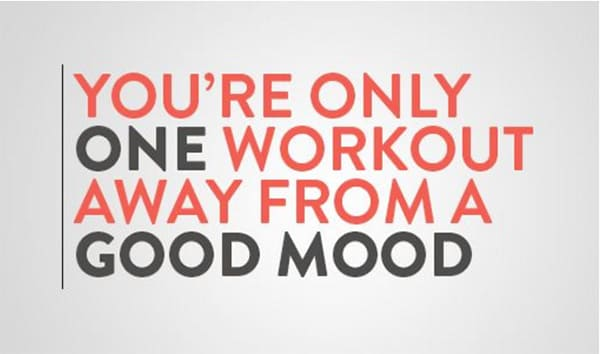

Photo owned by [openfit](https://www.openfit.com/20-motivational-quotes-to-help-you-reach-your-fitness-goals)

**Workout tips:**

* Set realistic goals
* Set a weekly program and stick to it
* Write down what you want to achieve with every training
* Find a workout buddy
* Eat at least one-two hours before you train
* Put on the clothes that make you feel motivated
* Make sure to choose the right workout for you
* Always warm up!
* Stay Hydrated
* Listen to music
* Don't forget to stretch!

**Workout motivation quotes:**

* No pain, No gain -> shut up and train
* Master your mindset, and you'll master your body
* Push yourself because no one else is going to do it for you
* The pain you feel today will be the strength you need tomorrow
* Later = Never (Do it now)
* Push harder than yesterday if you want a different tomorrow
* Its you vs you
* Never forget why you started
* Impossible is just a word
* You can if you believe you can
* Energy flows where attention goes
* Train insane or remain the same
* Good things come to those who sweat
* Someone busier than you is working out right now
* Hustle for that muscle
* Nothing truly great ever came from a comfort zone

**Different kinds of workouts and sports:**

* Aerobic Workouts
* Anaerobic workouts
* Crossfit
* Cycling
* Dance Workouts
* Freeletics (bodyweight workout)
* HIIT (High Intensity Interval Training)
* Pilates
* Powerlifting
* Running
* Tabata
* TRX
* Yoga

**Warm up**

* Boxing Warm Up [video](https://www.youtube.com/watch?v=GtFO7P8sr0E)
* Fun Warm Up [video](https://www.youtube.com/watch?v=jHw6HxD1j30&t=69s)
* Happy Dance Warm Up [video](https://www.youtube.com/watch?v=vNUWtyW0js0)
* Classic Full Body Warm Up [video](https://www.youtube.com/watch?v=wswdAzOfU1Y&t=122s)

**“Burning” particular muscle groups:**

* Arms & Back + Core training [video](https://www.youtube.com/watch?v=-UmT4WYhqH4)
* Buttocks lifting workout [video](https://www.youtube.com/watch?v=el1Cpk5B6OU)
* Lower body workout [video](https://www.youtube.com/watch?v=GPbhp1ENocQ&t=24s)
* Ab workout (NO EQUIPMENT) [video](https://www.youtube.com/watch?v=LND6Y5a3ks8)
* 50 min leg day workout [video](https://www.youtube.com/watch?v=9fiP1q2SWwM&t=46s)
* Arms and shoulders workout [video](https://www.youtube.com/watch?v=ME0cj3FTbms)

**Full body workouts:**

* Boxing cardio burn [video](https://www.youtube.com/watch?v=0Y8cy6qtIgg)
* 20 Minute easy mode (NO EQUIPMENT) [video](https://youtu.be/oAPCPjnU1wA)
* 20 Minute hard mode (NO EQUIPMENT) [video](https://youtu.be/yDQQVU__6Uc)
* Full body Dumbbell workout [video](https://www.youtube.com/watch?v=i-Kq8loq7fA)

**HIIT workouts:**

* 40 min HIIT + low intensity cardio (NO EQUIPMENT) [video](https://www.youtube.com/watch?v=Muh4Cyis_G8)
* Full body HIIT (NO EQUIPMENT) [video](https://www.youtube.com/watch?v=ec_buXYn9So)
* 40 min HIIT full body sculpt [video](https://www.youtube.com/watch?v=D2D9NUptqfk)
* 45 min full body HIIT workout [video](https://www.youtube.com/watch?v=pAOPPQFQgcQ&t=6s)

**Pilates workouts:**

* 40 min Power pilates workout [video](https://www.youtube.com/watch?v=AePgbGKj6yk)
* 30 min Power pilates workout [video](https://www.youtube.com/watch?v=oLuq_J_ptVw)
* 50 min Power pilates and cardio workout [video](https://www.youtube.com/watch?v=hNfsWaT00rw)

**Dance workouts (Have the best time and burn calories!):** 
* 10 min R&B Dance [video](https://www.youtube.com/watch?v=89lzERjtwqE&t=305s)
* 15 min Happy Dance [video](https://www.youtube.com/watch?v=Cw-Wt4xKD2s)
* 10 min Happy Cardio (AMAZIIIIIING) [video](https://www.youtube.com/watch?v=QPKXw8XEQiA)
* Dance fitness workout [video](https://www.youtube.com/watch?v=1XU4RCD85jM)

**Yoga:**

* 20 min Full Body Stress Relief [video](https://www.youtube.com/watch?v=sTANio_2E0Q&t=813s)
* 30 min Yoga Flow (with Maldives in the background) [video](https://www.youtube.com/watch?v=5v1wqxnrmrk&t=831s)
* 45 Minute Power Yoga Class with Ally Maz | lululemon [video](https://www.youtube.com/watch?v=lDbJdJWX82M)
* 45 Minute Everyday Vinyasa Flow Yoga Class | lululemon [video](https://www.youtube.com/watch?v=_kl_DxglATI)

or you can start a 30day Yoga Challenge with Adriene:
* Day 0 [video](https://www.youtube.com/watch?v=AjhvRX57XkE)
* Day 1 [video](https://www.youtube.com/watch?v=ZSIp00SewO8&t=1236s)
* Day 2 [video](https://www.youtube.com/watch?v=GaL3YF1vY2k)
* Day 3 [video](https://www.youtube.com/watch?v=hJjqx6YlcWs)

**Stretching:**

Whether you have worked out or not, don't forget to stretch daily! It will make you feel so much better and help you fix your posture and relax your muscles! Here are some videos to help you:

* Lower body stretch [video](https://www.youtube.com/watch?v=elcwsSqNhS8)
* Recovery day stretch [video](https://www.youtube.com/watch?v=2MHGldCeJ04)
* Foam roller stretch [video](https://www.youtube.com/watch?v=pCX3qmWYkS4)
* Hips and back stretch [video](https://www.youtube.com/watch?v=XVC8LGbxVG0)
* 6 min everyday stretch [video](https://www.youtube.com/watch?v=72MQmD8Z9Zw&t=300s)
* 8 min sitting too much stretch [video](https://www.youtube.com/watch?v=12pSXygAzwk)
* 10 min full body stretch [video](https://www.youtube.com/watch?v=xOqGI7EDe6U)

**Workout apps:**

Quarantine gives you  a great opportunity to feel healthy again.These apps will make you fall in love with exercising.

* Plank Workout at Home-30 days Plank Challenge[Link](https://play.google.com/store/apps/details?id=fat.burnning.plank.fitness.loseweight&hl=el&gl=US)
* Flexibility Training & Stretching Exercise at Home[Link](https://play.google.com/store/apps/details?id=com.fitifyapps.bwstretching&hl=en_US&gl=US)
* Yoga daily fitness - Yoga workout plan[Link](https://play.google.com/store/apps/details?id=com.ssstudio.yogadailyfitness&hl=en_US&gl=US)
* Yoga Workout-Yoga&Meditation for Daily Fitness [Link](https://play.google.com/store/apps/details?id=com.homefit.yoga.health&hl=en_US&gl=US)

**Running:**

The quarantine is a great opportunity to practice your running skills. Running during quarantine is a great way improve your stamina and compete to various virtual running challenges with others around the globe, and why not, attempt to run your first marathon! Below you may find useful running tutorials:

* Useful Running Tips for Beginners [video](https://www.youtube.com/watch?v=kVnyY17VS9Y)
* Run your first 5k [video](https://www.youtube.com/watch?v=YACmfwcBDnM&list=PLRjIvR8JIRzE6plDzDDwkUmjR5be_aud1)
* Keep a perfect running form [video](https://www.youtube.com/watch?v=brFHyOtTwH4)
* Useful 2+ hour run tips [video](https://www.youtube.com/watch?v=xzlmjvLpKw8)

You may also find some really useful running guides and training plans for beginner and experienced runners [here](https://www.runningshoesguru.com/free-running-training-plans/).

* **Running apps:** using exercise tracking apps to train, has been proven to greatly increase motivation ([related paper](https://www.sciencedirect.com/science/article/pii/S0747563220302752?casa_token=DE2BlRmSeAIAAAAA:6DqidfQjZrwM_oiVU2E73e9lxkYNjupnNKCCkGkqbSVXWIzm4PoEtMbJmoiJ000TFQ1zIQ9-)). Downloading a running app may help you achieve your goals faster, keep track of your daily exercise routine as well as socialize with people sharing the same passion for exercise! Below, you may find some useful running apps to download:
  * Best for getting motivated: [Human](http://human.co/#)
  * Best for adopting running into your daily routine: [Pacer](https://www.mypacer.com/)
  * Best professional running app: [Strava](https://www.strava.com)
  * Best for creating training plans: [Runcoach](https://runcoach.com)

**Cycling:**

The quarantine is definitely the perfect period to exercise more and even adopt new ways of exercise. Cycling during the hard times of quarantine can easily boost your mood while improving your stamina, strength and aerobic fitness as well. Don't forget that with a bike you can explore many hidden gems of Athens that you had no idea of. 
So, what are you waiting? Take your dusty bike and start cycling this moment!

In case you don't already own a bicycle don't worry, you can buy one without much effort. Below, you may easily find some useful tips:

* Picking the perfect bicycle for Beginners [Link](https://lifehacker.com/the-beginners-guide-to-picking-the-perfect-bicycle-1782443592)
* Five types of bikes to choose from [video](https://www.youtube.com/watch?v=Znt0UuZW2nU)

If not ready to buy a bike, don't forget you can also rent one. Here are some sites:

* Athens Bike Rental [Link](https://www.athensbikerental.gr/rentals)
* Panorama Bikes [Link](https://panoramabikes.gr/el/134-rent-a-bike-athens-greece)
* GRCYCLING [Link](https://booking.grcycling.com/bikes)

Once you have all the equipment needed, take many water bottles, maybe a sibling or a friend and go explore. Don't be afraid to go beyond your neighborhood. Here are some interesting ideas of destinations:

* Top Tips for Cycling in Athens [Link](https://www.thisisathens.org/activities/sports-outdoors/biking-cycling)

---

## Video call your long-distance friends
Do you remember the nights when you used to hang out for hours with your friends? Since that is not possible any more you can use the following software to replicate the group feeling:
- Skype
- FaceTime
- Microsoft Teams
- Zoom
- Discord
- Or check out these [open source alternatives](https://opensource.com/alternatives/skype)

Virtual Activities:
- Sing karaoke 

This is pretty much self-explanatory. Pick a song, find its karaoke version on YouTube and sing along! Tip: make sure everyone else's microphones are mute.

- Disguised party 

This can go in two ways. You can discuss with the group the theme of disguise for your next group call and everyone dresses accordingly OR each person picks their costume individually. It feels just like Halloween! How fun!

- PowerPoint party 

Essentially, everyone picks a topic near and dear to their heart —the more niche, the better— and prepare a five-minute PowerPoint presentation on it. Here's some fun and interesting ideas: Drunk history, The best [whatever] of all time, Ranking and rating my exes, How HSM changed my life

- Movie/series night 

Watch a movie or a series with your group of friends without leaving your home, just by screen sharing in a video call or using streaming platforms like Netflix Party. Plus, you can comment on it in chat without disturbing others.

- Play an online game

Who says you have to be in the same space to have fun? Gather your friends and prepare for the best game night ever! There are a lot of different virtual games to choose from, but you should always check the number of players every game allows. No one should be left behind! You can find a list of virtual board games [here](#board-games).

---

##  Gardening
Gardening is a very unique hobby to relax, feel creative and spend your time.
Here are some of the vegetables that you can begin with! 

|VEGETABLE| GROW TIME (days)| VITAMINS| COLD HARDNESS | WHEN TO WATER |
|---| ---| ---| ---| ---|
| Broccoli  | 100-150  | 	A, E, B1, and B6|	Hardy | Only during drought conditions |
| Carrots  | 70-80  | 	A, C, K, and B6|	Half-hardy | Only during drought conditions |
| Peppers  | 60-90 | 	 A, C, B6, B2, and E|	Very tender | Once a week |
| Potatoes  | 90-120  | 	B6 and C|	Half-hardy | Regularly, when tubers start to form |
| Pumpkins  | 90-100  | 	Fiber, C, and Potassium|	Tender | Only during drought conditions |
| Tomatoes  | 65-85  | 	 A, C, K, and B6|	Tender | Twice a week |
| Zucchini  | 50-60  | 	 A, B1, B6, and B2 | Very tender | Frequently, especially when fruits form |

### Easy-to-grow plants

| PLANT NAME | PLANT TYPE | BLOOM TIME | SUN EXPOSURE | LINK |
|---|---|---|---|---|
|Asparagus Fern| Annual, houseplant | Summer | Indirect light (indoors); part sun (outdoors) | [More info](https://www.thespruce.com/grow-asparagus-ferns-1902714)|
|Chinese Evergreen| Herbaceous perennial | Spring, summer | Partial shade, full shade | [More info](https://www.thespruce.com/grow-aglaonema-houseplants-1902734)|
|Chinese Money Plant | Evergreen perennial | Spring |  Bright indirect light | [More info](https://www.thespruce.com/growing-pilea-peperomioides-5090425)|
|Croton Plant | Evergreen shrub | Doesn't bloom | Bright, indirect light | [More info](https://www.thespruce.com/grow-codiaeum-variegatum-1902750)|
|Jade Plant| Succulent | Spring | Full sun | [More info](https://www.thespruce.com/grow-jade-plants-indoors-1902981)|
|Peace Lily | Flowering tropical plant | Spring | Medium, indirect light | [More info](https://www.thespruce.com/grow-peace-lilies-1902767)|
|Pothos| Vine | Doesn't bloom | Full sun, partial shade | [More info](https://www.thespruce.com/pothos-an-easy-to-grow-houseplant-1403154)|
|Tillandsia | Air Plant | Doesn't bloom | Bright, indirect sunlight | [More info](https://www.thespruce.com/grow-air-plants-1902663)|
|Yucca | Herbaceous perennials | Mid-summer to early fall | Full sun or bright, indirect sun | [More info](https://www.thespruce.com/grow-yucca-inside-1902500)|

Photo owned by [kellogggarden.com](https://www.kellogggarden.com/wp-content/uploads/2017/07/Leafy-Vegetable-Garden.jpg)  
Icon source: [thenounproject.com ](https://thenounproject.com/term/gardening/) 

---

## Learn a new skill
Great ideas to learn new skills:

* Learn a new programming language
* Learn a new foreign language
* Learn how to draw
* Learn how to speak in public
* Learn basic home repairs
* Learn how to play a music instrument
* Learn [a new subject](https://www.futurelearn.com/subjects)
* Learn [how to start a garden](https://www.youtube.com/watch?v=B0DrWAUsNSc&ab_channel=SSLFamilyDad)
* Learn self-defense
* Learn how to [embroider](https://www.youtube.com/watch?v=2ATJuHN-C9A&ab_channel=byCHLOEWEN)
* Learn how to [knit](https://www.youtube.com/watch?v=p_R1UDsNOMk&ab_channel=RJKnits)
* Learn to type, [here is a useful platform](https://www.typingclub.com/)
* Learn [how to cook, easily among the best!](https://akispetretzikis.com/ "Akis Petretzikis")
* Learn one easy [magic trick](https://www.youtube.com/watch?v=lhu2hGLz0FY) that will impress everyone

---

## Meditation
Meditation is a fun and relaxing way to spend your time in quarantine. Try lying down with your eyes closed and focusing on your breath, breathing in and out. This will help you lower stress levels, boost your mood, allow you to connect better with yourself and improve your focus.
* 5-minute meditation - [link](https://www.youtube.com/watch?v=inpok4MKVLM&t=71s&ab_channel=Goodful)
* 10-minute meditation - [link](https://www.youtube.com/watch?v=O-6f5wQXSu8&ab_channel=Goodful)
* 20-minute meditation - [link](https://www.youtube.com/watch?v=-2zdUXve6fQ&ab_channel=TheMindfulMovement)
>[Here is a good playlist to help you relax!](https://www.youtube.com/watch?v=oJnF5VxTO5g "Chill & Relax")

#### If you are a beginner, here are a few steps to help you start:
1. Find a nice place in your house and take a seat
2. Set a time limit (5-10 minutes for starters)
3. Notice your body, make sure you are stable and in a position where you can stay for a long time.
4. Feel your breath
5. Notice when your mind has started focusing on different thoughts and not your breath
6. Be kind to your mind's behavior
7. When you are ready open your eyes, look up and notice the environment's sounds. Notice your thoughts and emotions.

---

## Movies-Documentaries-Series
_The most common activity during lock-down has been watching movies. So here are our recommendations for movies, series and documentaries:_

|TITLE| TYPE| AVAILABLE ON| MY RATING| IMDb RATING| TRAILER| INFO|
|:---| :---:| :---:| :---:| :---:|:---:|:---:|
|A Beautiful Mind | Biography / Drama | Netflix | 9/10 | 8.2/10|[TRAILER](https://www.youtube.com/watch?v=nIR3wj9Ssaw "A Beautiful Mind")|[INFO](https://www.imdb.com/title/tt0268978/?ref_=nv_sr_srsg_0 "A Beautiful Mind IMDb")|
|Attack On Titan | Fantasy / Action | Crunchyroll | 9.9/10 | 8.9/10|[TRAILER](https://www.youtube.com/watch?v=MGRm4IzK1SQ "Attack On Titan")|[INFO](https://www.imdb.com/title/tt2560140/?ref_=nv_sr_srsg_0 "Attack On Titan IMDb")|
|Babyteeth| Comedy, Drama, Music | Cinobo | 6/10 | 7.2/10 | [TRAILER](https://www.imdb.com/video/vi3688152601?playlistId=tt8399664&ref_=tt_ov_vi) | [INFO](https://www.imdb.com/title/tt8399664/?ref_=rt_li_i) |
|Better Call Saul | Crime / TV Series | Netflix | 10/10 | 8.7/10 | [TRAILER](https://www.youtube.com/watch?v=HN4oydykJFc "Better Call Saul")|[INFO](https://www.imdb.com/title/tt3032476/?ref_=nv_sr_srsg_0 "Better Call Saul")|
|Blacklist | TV series | Netflix | 9/10 | 8/10|[TRAILER](https://www.youtube.com/watch?v=-WYdUaK54fU "Blacklist")|[INFO](https://www.imdb.com/title/tt2741602/?ref_=nv_sr_srsg_0 "Blacklist IMDb")|
|Breaking Bad| TV series| Netflix| 9/10| 9.5/10|[TRAILER](https://www.youtube.com/watch?v=HhesaQXLuRY&ab_channel=TrailerBlend "Breaking Bad")|[INFO](https://www.imdb.com/title/tt0903747/?ref_=nv_sr_srsg_0 "Breaking Bad IMDb")|
|Brooklyn Nine-Nine | TV series | Netflix | 8.5/10 | 8.4/10|[TRAILER](https://www.youtube.com/watch?v=sEOuJ4z5aTc "Brooklyn Nine-Nine")|[INFO](https://www.imdb.com/title/tt2467372/?ref_=nv_sr_srsg_0 "Brooklyn Nine-Nine IMDb")|
|Cobra Kai| Action / Comedy / Drama | Netflix| 9/10| 8.6/10|[TRAILER](https://youtu.be/xCwwxNbtK6Y "Cobra Kai")|[INFO](https://www.imdb.com/title/tt7221388// "Cobra Kai")|
|Community | TV series | Netflix | 9/10 | 8.5/10|[TRAILER](https://www.youtube.com/watch?v=sBCE9oIuN24 "Community")|[INFO](https://www.imdb.com/title/tt1439629/ "Community IMDb")|
|Connected| Documentary - TV series| Netflix| 8.5/10| 7.5/10|[TRAILER](https://www.youtube.com/watch?v=B-aZrftUPlk&ab_channel=Netflix "Connected")|[INFO](https://www.imdb.com/title/tt12753692/?ref_=nv_sr_srsg_3 "Connected IMDb")|
|Cowspiracy: The Sustainability Secret | Documentary | Netflix | 9/10 | 8.3/10|[TRAILER](https://www.youtube.com/watch?v=nV04zyfLyN4 "Cowspiracy: The Sustainability Secret")|[INFO](https://www.imdb.com/title/tt3302820/ "Cowspiracy: The Sustainability Secret")|
|Don't f**k with cats| Documentary - TV series| Netflix| 9/10| 8/10|[TRAILER](https://www.youtube.com/watch?v=x41SMm-9-i4&ab_channel=Netflix "Don't f**k with cats")|[INFO](https://www.imdb.com/title/tt11318602/?ref_=fn_al_tt_2 "Don't f**k with cats IMDb")|
|Game Of Thrones | TV series | HBO | 10/10 | 9.3/10|[TRAILER](https://www.hbo.com/game-of-thrones "Game Of Thrones")|[INFO](https://www.imdb.com/title/tt0944947/ "Game Of Thrones IMDb")|
|House of Cards | Comedy / TV Series | Netflix | 8.5/10 | 8.7/10|[TRAILER](https://www.youtube.com/watch?v=SvSkxBYuoQY "House of Cards")|[INFO](https://www.imdb.com/title/tt1856010/?ref_=hm_tpks_tt_i_15_pd_tp1_cp "House of Cards")|
|How I met your mother | Comedy / TV Series | Netflix | 9/10 | 8.3/10|[TRAILER](https://www.youtube.com/watch?v=aJtVL2_fA5w "How I met your mother")|[INFO](https://www.imdb.com/title/tt0460649/ "How I met your mother")|
|Infinity War | Action / Adventure / Sci-Fi | Disney+ |10/10 | 8.4/10|[TRAILER](https://youtu.be/6ZfuNTqbHE8 "Infinity War")|[INFO](https://www.imdb.com/title/tt4154756/?ref_=nv_sr_srsg_0 "Infinity War IMDb")|
|It's Okay to Not be Okay | Drama | Netflix | 9.5/10 | 8.7/10 | [TRAILER](https://www.youtube.com/watch?v=50ek4HQo0Bc&ab_channel=TheSwoon "It's Okay to Not be Okay")|[INFO](https://www.imdb.com/title/tt12451520/ "It's Okay to Not be Okay")|
|Jeffrey Epstein: Filthy Rich | Documentary / Crime | Netflix | 8/10 | 7.1/10|[TRAILER](https://www.youtube.com/watch?v=-j0rjlfmDx4 "Jeffrey Epstein: Filthy Rich")|[INFO](https://www.imdb.com/title/tt12312250/ "Jeffrey Epstein: Filthy Rich")|
|Joker| Drama | Amazon | 10/10 | 8.4/10|[TRAILER](https://www.youtube.com/watch?v=zAGVQLHvwOY "Joker")|[INFO](https://www.imdb.com/title/tt7286456/?ref_=nv_sr_srsg_0 "Joker IMDb")|
|La La Land| Film Musical | Stremio | 9/10 | 8/10 | [TRAILER](https://www.youtube.com/watch?v=0pdqf4P9MB8&ab_channel=LionsgateMovies) | [INFO](https://www.imdb.com/title/tt3783958/)|
|Lupin| TV series| Netflix| 7.5/10| 7.6/10|[TRAILER](https://www.youtube.com/watch?v=ga0iTWXCGa0&ab_channel=Netflix "Lupin")|[INFO](https://www.imdb.com/title/tt2531336/?ref_=nv_sr_srsg_0 "Lupin IMDb")|
|Mindhunter | TV series | Netflix | 9.5/10 | 8.6/10|[TRAILER](https://www.youtube.com/watch?v=evdxH50J3rs "Mindhunter")|[INFO](https://www.imdb.com/title/tt5290382/?ref_=nv_sr_srsg_0 "Mindhunter IMDb")|
|Miracle in Cell No. 7 (2019)| Drama | Netflix | 9/10 | 8.2/10|[TRAILER](https://www.youtube.com/watch?v=MHdBW0gSsjo "Miracle in Cell No. 7")|[INFO](https://www.imdb.com/title/tt2659414/?ref_=nv_sr_srsg_0 "Miracle in Cell No. 7 IMDb")|
|Mr. Robot | TV series | Netflix | 10/10 | 8.5/10|[TRAILER](https://www.youtube.com/watch?v=xIBiJ_SzJTA "Mr. Robot")|[INFO](https://www.imdb.com/title/tt4158110/?ref_=fn_al_tt_1 "Mr. Robot IMDb")|
|Night Stalker: The Hunt for a Serial Killer  | Documentary / Crime | Netflix | 9/10 | 7.5/10|[TRAILER](https://www.youtube.com/watch?v=Mva2nGveYss "Night Stalker: The Hunt for a Serial Killer")|[INFO](https://www.imdb.com/title/tt13651632/ "Night Stalker: The Hunt for a Serial Killer")|
|Peaky Blinders | Documentary - TV series | Netflix | 8/10 | 8.8/10|[TRAILER](https://youtu.be/oVzVdvGIC7U "Peaky Blinders")|[INFO](https://www.imdb.com/title/tt2442560/?ref_=nv_sr_srsg_0 "Peaky Blinders IMDb")|
|Prison Break | Action / TV Series | Netflix | 10/10 | 8.3/10 | [TRAILER](https://www.imdb.com/video/vi3183588377?playlistId=tt0455275&ref_=tt_ov_vi "Prison Break")|[INFO](https://www.imdb.com/title/tt0455275/ "Prison Break")|
|Rick and Morty | Comedy / TV Series | Netflix | 9/10 | 9.2/10 | [TRAILER](https://www.youtube.com/watch?v=_uUcMwsR5hg "Rick and Morty")|[INFO](https://www.imdb.com/title/tt2861424/ "Rick and Morty")|
|Spider-Man: Into the Spider-Verse | Animation, Action, Adventure |Stremio | 9/10 | 8.4/10 | [TRAILER](https://www.youtube.com/watch?v=tg52up16eq0&ab_channel=SonyPicturesEntertainment)| [INFO](https://www.imdb.com/title/tt4633694/)|
|Suits | TV series | Netflix | 9/10 | 8.5/10|[TRAILER](https://www.youtube.com/watch?v=85z53bAebsI "Suits")|[INFO](https://www.imdb.com/title/tt1632701/?ref_=fn_al_tt_1 "Suits IMDb")|
|The 100 | Sci-Fi | Netflix | 9.5/10 | 7.6/10|[TRAILER](https://www.youtube.com/watch?v=ia1Fbg96vL0 "The 100")|[INFO](https://www.imdb.com/title/tt2661044/?ref_=nv_sr_srsg_0 "The 100 IMDb")|
|The Big Bang Theory| Comedy/TV Series| Netflix| 8.5/10| 8.1/10|[TRAILER](https://www.youtube.com/watch?v=WBb3fojgW0Q&ab_channel=vidicsch "The Big Bang Theory")|[INFO](https://www.imdb.com/title/tt0898266/ "The Big Bang Theory")|
|The Bold Type| Comedy/TV Series| Netflix| 8.0/10| 8.0/10|[TRAILER](https://www.youtube.com/watch?v=q9Evo8pJTV0&ab_channel=Freeform "The Bold Type")|[INFO](https://www.imdb.com/title/tt6116060/ "The Bold Type")|
|The Boys| TV series| AmazonPrime| 7/10| 8.7/10|[TRAILER](https://www.youtube.com/watch?v=M1bhOaLV4FU&ab_channel=AmazonPrimeVideoUK "The Boys")|[INFO](https://www.imdb.com/title/tt1190634/?ref_=nv_sr_srsg_0 "The Boys IMDb")|
|The Flash | Action / Adventure / Drama | Netflix| 7.7/10| 7/10|[TRAILER](https://youtu.be/Yj0l7iGKh8g "The Flash")|[INFO](https://www.imdb.com/title/tt3107288/ "The Flash")|
|The Invisible Guest | Crime / Drama / Mystery | Netflix | 8.5/10 | 8.1/10|[TRAILER](https://www.youtube.com/watch?v=epCg2RbyF80 "The Invisible Guest")|[INFO](https://www.imdb.com/title/tt4857264/?ref_=nv_sr_srsg_0 "The Invisible Guest IMDb")|
|The Last Dance| Documentary - TV series| Netflix| 9.5/10| 9.1/10|[TRAILER](https://www.youtube.com/watch?v=N9Z9JtNcCWY&ab_channel=ESPN "The Last Dance")|[INFO](https://www.imdb.com/title/tt8420184/?ref_=fn_al_tt_1 "The Last Dance IMDb")
|The Name of the Rose|  Crime, Drama, Mystery| Cinobo| 7/10 | 7.7/10 | [TRALER](https://www.youtube.com/watch?v=7-yYJgpQ-CE&ab_channel=MovieclipsClassicTrailers) | [INFO](https://www.imdb.com/title/tt0091605/?ref_=rt_li_tt) |
|The Queen's Gambit | TV series | Netflix | 9/10 | 8.6/10|[TRAILER](https://www.youtube.com/watch?v=CDrieqwSdgI "The Queen's Gambit")|[INFO](https://www.imdb.com/title/tt10048342/?ref_=nv_sr_srsg_0 "The Queen's Gambit IMDb")|
|The Shutter Island | Thriller/ Mystery | Netflix | 8.5/10 | 8.2/10|[TRAILER](https://www.youtube.com/watch?v=5iaYLCiq5RM "The Shutter Island")|[INFO](https://www.imdb.com/title/tt1130884/ "The Shutter Island IMDb")|
|The Social Dilemma| Documentary| Netflix| 7/10| 7.6/10|[TRAILER](https://www.youtube.com/watch?v=uaaC57tcci0&ab_channel=Netflix "The Social Dilemma")|[INFO](https://www.imdb.com/title/tt11464826/?ref_=nv_sr_srsg_0 "The Social Dilemma IMDb")|
|Unsolved Mysteries| Documentary - TV series| Netflix| 9/10| 7.3/10|[TRAILER](https://www.youtube.com/watch?v=oZ4FrgGILM8&ab_channel=Netflix "Unsolved Mysteries")|[INFO](https://www.imdb.com/title/tt9642938/?ref_=nv_sr_srsg_3 "Unsolved Mysteries IMDb")|
|World's Most Wanted| Documentary / Crime| Netflix| 7.5/10| 7.2/10|[TRAILER](https://www.youtube.com/watch?v=TFOYTE3RtCs "World's Most Wanted")|[INFO](https://www.imdb.com/title/tt12753698/ "World's Most Wanted")|

---        

## Music
Music is probably the best way to survive while at home. Whether you headbang while doing your assignments, sing in the shower or leave the computer to stretch your fingers with that chord, you have probably already noticed that slight brightening to your soul.

### Playlists 
You can have an amazing time just by relaxing and listening to your favorite music. Here are some music playlists you might enjoy:
* Ambient Study Music [listen here](https://www.youtube.com/watch?v=sjkrrmBnpGE)
* Cozy evenings (a chill mix) [listen here](https://www.youtube.com/watch?v=tHNSzNlgRZA&t=217s)
* Greek "Plintirio* playlist [listen here](https://open.spotify.com/playlist/0X4ZYdFFZKnizCaT2WCro9?si=ghSDdd5tQwOhHPgLbhFikA)
* Italian songs to dance to [listen here](https://www.youtube.com/watch?v=dsb9Fakq1A8)
* Piano Acoustic Music [listen here](https://www.youtube.com/watch?v=wmFz6CD-MTE)
* Relaxing Jazz Music [listen here](https://www.youtube.com/watch?v=neV3EPgvZ3g)
* Top 40 songs of 2020 2021 [listen here](https://www.youtube.com/watch?v=_pLO4jFDeIc)
* Top techno songs [listen here](https://open.spotify.com/playlist/6g7ZfOfEqqSR4o7iPVZggC?si=jDMehvIDSweA0UJqu4Vhng)

### Songs
Most of us can't imagine how lockdown would be like without our favorite songs. Here are some great songs you may not know:
<!--- It would be nice to add songs that aren't widely known! In this way we can discover new music :) -->
* All Around Me, by Aaronya [listen here](https://www.youtube.com/watch?v=min5dZxrXLQ&ab_channel=Aaronya-Topic)
* All Time, by Tyler Ward, Mike Tompkins and KHS [listen here](https://www.youtube.com/watch?v=dkcs-26PBjY)
* All of Me, John Legend [listen here](https://www.youtube.com/watch?v=73_DOquGBD4)
* Always, by Isak Danielson [listen here](https://www.youtube.com/watch?v=YZdyIgst-S4)
* American Pie, Don McLean [listen here](https://www.youtube.com/watch?v=iX_TFkut1PM)
* Black Magic Woman, Santana [listen here](https://www.youtube.com/watch?v=wyQUCYl-ocs)
* Bloom Later (Audio), by Jesse [listen here](https://www.youtube.com/watch?v=XCirsEZCGO4&list=PLRQDSvpEpYzBUdlMzMhAWSD4TyE0ga7Et&index=2)
* Brain Damage, Pink Floyd [listen here](https://www.youtube.com/watch?v=BhYKN21olBw)
* CLOUDS, by NF [listen here](https://www.youtube.com/watch?v=fibYknUCIU4)
* Cat People, David Bowie [listen here](https://www.youtube.com/watch?v=A9I7U4nuR_I)
* Closer, by Chainsmokers [listen here](https://www.youtube.com/watch?v=PT2_F-1esPk)
* Demons, by Imagine Dragons [listen here](https://www.youtube.com/watch?v=mWRsgZuwf_8)
* FEVER, by Megan Nicole [listen here](https://www.youtube.com/watch?v=DV30BtjNNIU) 
* Faith, by the Weeknd [listen here](https://www.youtube.com/watch?v=RcS_8-a-sMg&ab_channel=TheWeekndVEVO)
* Flatlands, The Aristocrats [listen here](https://www.youtube.com/watch?v=fW0p5SB52sI&list=LL&index=39)
* From the Woods, James Vincent McMorrow [listen here](https://www.youtube.com/watch?v=ntZG2InulxE)
* Girls Like You, Maroon 5 ft. Cardi B [listen here](https://www.youtube.com/watch?v=aJOTlE1K90k)
* Glassy Sky, Donna Burke [listen here](https://www.youtube.com/watch?v=vvvvcpwFw5o)
* Grey Area, by Sam Tsui [listen here](https://www.youtube.com/watch?v=GNOUmctP3Yo)
* Holding on and Letting Go, by Ross Copperman [listen here](https://www.youtube.com/watch?v=NQv7DL-MAkk)
* Hypnotized, by Purple Disco Machine, Sophie and the Giants [listen here](https://www.youtube.com/watch?v=UbYQErtM9Zk)
* Killer Queen, Queen [listen here](https://www.youtube.com/watch?v=2ZBtPf7FOoM)
* La Cintura, by Alvaro Soler ft. Flo Rida, TINI [listen here](https://www.youtube.com/watch?v=oRMAgjly2UQ)
* Layla, Eric Clapton [listen here](https://www.youtube.com/watch?v=AVd4WY_Y9Dc)
* Legends Never Die, League of Legends ft. Against The Current [listen here](https://www.youtube.com/watch?v=4Q46xYqUwZQ)
* Love Is The Name, by Sofia Carson [listen here](https://www.youtube.com/watch?v=fuyVJYP7GJk)
* Memories, by Maroon 5 [listen here](https://www.youtube.com/watch?v=SlPhMPnQ58k)
* More Than Words, by Extreme [listen here](https://www.youtube.com/watch?v=UrIiLvg58SY)
* Natural Blues, Moby [listen here](https://www.youtube.com/watch?v=z3YMxM1_S48)
* New Morning, Monolink [listen here](https://open.spotify.com/track/1XYGVM8TsjeadnoNG4ZKbh?si=02CL6KwhSL-l2jI9zt15uw)
* New Rules, John Legend [listen here](https://www.youtube.com/watch?v=k2qgadSvNyU)
* Nothing Around us, Mathame [listen here](https://www.youtube.com/watch?v=C0pRbPlTVbo)
* Obsesión, by Aventura ft. Judy Santos [listen here](https://www.youtube.com/watch?v=8_QY5gFQUTg)
* Paralyzed, Against The Current [listen here](https://www.youtube.com/watch?v=PvVhUo-PvVI) 
* Porcelain, Moby [listen here](https://www.youtube.com/watch?v=13EifDb4GYs)
* Put Your Hands Up, by Boiling Point Band [listen here](https://www.youtube.com/watch?v=57SKB6Er88c)
* Respect Is What you Hear, The Weather Underground [listen here](https://www.youtube.com/watch?v=DcjdVsx-VoE)
* Sleep on the Floor, Lumineers [listen here](https://www.youtube.com/watch?v=v4pi1LxuDHc)
* Space Song, by Beach House [listen here](https://www.youtube.com/watch?v=RBtlPT23PTM&list=PLRQDSvpEpYzBUdlMzMhAWSD4TyE0ga7Et&index=4)
* Spring 1, recomposed by Max Richter (original by Vivaldi) [listen here](https://www.youtube.com/watch?v=41IOkVjy3MM)
* Strangers In The Night, Frank Sinatra [listen here](https://www.youtube.com/watch?v=ZwAERaRUsp0)
* Summer Breeze, Seals and Crofts [listen here](https://www.youtube.com/watch?v=GQQbjpomexo)
* Survival, Muse [listen here](https://www.youtube.com/watch?v=bKFhS0cQLE8)
* TOP OF THE WORLD, ZAYDE WOLF [listen here](https://www.youtube.com/watch?v=Sdy9PY0CVQ0)
* Te Quiero Más, TINI and Nacho [listen here](https://www.youtube.com/watch?v=95IaQ8vyqHg)
* The Best (feat. Alice Merton), by Awolnation [listen here](https://www.youtube.com/watch?v=l-A43Av9ICo&list=PLRQDSvpEpYzBUdlMzMhAWSD4TyE0ga7Et&index=6)
* The Fuss, Against The Current [listen here](https://www.youtube.com/watch?v=y_Qsrt6c9_k)
* The Logical Song, Supertramp [listen here](https://www.youtube.com/watch?v=low6Coqrw9Y)
* Una volta ancora, by Fred De Palma [listen here](https://www.youtube.com/watch?v=4R5mDpIgwUs)
* United States of Eurasia, Muse [listen here](https://www.youtube.com/watch?v=-5-K51jHQ6k)
* War of Change, Thousand Foot Krutch [listen here](https://www.youtube.com/watch?v=HdnTSXUWd3E)
* White Room, Cream [listen here](https://www.youtube.com/watch?v=V5BF1V1pbTs)
* Wild, Jonas Blue ft. Chelcee Grimes, TINI, Jhay Cortez [listen here](https://www.youtube.com/watch?v=BQogzYUoQWU)
* With Ease, by Kelly the Lone [listen here](https://www.youtube.com/watch?v=GehP0qnsTSE&list=OLAK5uy_k75FWZaGaBNvCx6dDQG7OekUxw8P1mCe8&ab_channel=KellyTheLone-Topic)

### Albums
A subsection to add your favorite Music Albums

* A night at the opera (2011 Remaster), by Queen [listen here](https://open.spotify.com/album/1GbtB4zTqAsyfZEsm1RZfx?si=bcOcHr7lSbS2PGYLVyT-XQ)
* American Idiot (2004), by Green Day [listen here](https://open.spotify.com/album/5dN7F9DV0Qg1XRdIgW8rke?si=4eMZxuPfQE6YsZkQLZTTsw)
* La La Land (2016), by Justin Hurwitz [listen here](https://open.spotify.com/album/3GU8BzFEAdFSRjc8jZkL3S)
* Les Misérables (1985), by London Cast Recording [listen here](https://open.spotify.com/album/3QnkeixkKiKpP3ObLb7DtT)
* Nothing Around us (2018), by Mathame [listen here](https://open.spotify.com/album/3S8eBDaNXOgauG0Rtco6Kj?si=ShHzHVxeTeC9-az0szKw4A)
* Play (2014 Remastered Version), by Moby [listen here](https://open.spotify.com/album/7yqSkf4TGPOHUtDKMVjhbD?si=lCj-kEh1QiuvGlsTQwfLVA)
* Wake me up (2020), by Tale of Us [listen here](https://open.spotify.com/album/7aeL8XFsUp7BF7Jps0DoRi?si=iZUpANWlRZivHWit3_UTbw)

### Musical Instruments
You are never actually too old to learn to play an instrument you have always liked. It is a perfect break from your laptop's screen.

#### Guitar

Photo owned by [ro.ieftin2021.com](https://ro.ieftin2021.com/category?name=guitarr)

You will get surprised from how easily you can produce nice sounds. All you need to begin is:
* a [tuning app](https://play.google.com/store/apps/details?id=com.ovelin.guitartuna&hl=en&gl=US)
* a set of strings
* a footstool (recommended for classical guitar)
* and of course the guitar

You can either teach yourself with a huge collection of online tutorials and tabs or find a teacher and have online lessons. You can check out [Kurt Berg's](https://www.youtube.com/channel/UCOSmaT73sJrjOmf6PHjxVAQ) YouTube channel for easy beginner tutorials. [Sky Guitar](https://www.youtube.com/channel/UCDlfXUX_wYgyfiXbfQh96Eg) also has a good deal of classical guitar tutorials for different levels.

There are 3 major guitar types:

* *Nylon acoustic (classical):* It produces a mellow sound and it's ideal for beginners, as the strings are easy to pick and it is lightweight and cheap. However, it has wider fretboard.
* *Steel string acoustic:* The strings produce a brighter tone and they are ideal for strumming. However, building calluses can be really painful for beginners.
* *Electric:* You will need at least an amp as the sound is produced from electric signals. It also uses steel strings and it is a bit heavier. Nonetheless, it is great for creativity with many technics and effects. 

Source: https://www.artistguitars.com.au/buying/how-to-choose-a-guitar-in-2-simple-steps

### You want to learn guitar?

Here you can see some useful videos to start learning!

* [10 easy pieces for beginners](https://youtu.be/cd62yluRmsc/)
* [10 best and easy riffs for beginners](https://youtu.be/7PxvFRFIFFg/)
* [5 basic rhythms in Guitar](https://youtu.be/f-tJjTIZvWI/)
* [How to find the rythm of a song](https://youtu.be/OcPL-iFbKUI/)
* [The most important rhythm in guitar](https://youtu.be/RYVQ4SDbPWc/)

#### Piano

Photo owned by [worldsecrets.gr](https://www.worldsecrets.gr/sunavlia-piano/learn-piano/)

While there is no doubt that having a good traditional teacher can be helpful, the fact is you can teach yourself how to play piano/keyboard very effectively by attending online piano lessons or watching online guides. You can check out [MangoldProject's Piano Lessons for Beginners](https://www.youtube.com/watch?v=827jmswqnEA&list=PLP9cbwDiLzdL6IS4-rmzR42ghq3T56XnK), which is a helpful step by step guide for learning to play on a keyboard.

#### Ukulele

Photo owned by [nytimes.com](https://www.nytimes.com/wirecutter/reviews/best-ukulele-for-beginners/)

It really doesn't matter how old or young you are, and even if you’ve never played music before in your life, you can learn how to play ukulele… even today! All you need to do is to:
* borrow a ukulele from a friend or buy one that feels right for you
* get in the right mindset to play and put aside your fears and doubts about playing
* tune your ukulele
* practice some chords starting with C
* practice a strumming pattern
* learn a song and enjoy yourself

Source: https://ukuleletricks.com/how-to-play-ukulele/

### Writing/Composing Music

The quarantine is a great opportunity if you want to compose your own music! You can check out [MuseScore](https://musescore.com/), the world's leading free and open-source software for writing music. It offers a user-friendly interface and immensely powerful features. If you are interested, you may also want to check out MuseScore's GitHub repository [here](https://github.com/musescore/MuseScore).

Additionally, MuseScore offers a large database of free-to-access sheet music. You can find sheet music ranging from [Imagine by John Lennon](https://musescore.com/user/6662591/scores/4369656) to [Undertale theme song](https://musescore.com/user/5174461/scores/1321576)!

---

## Study online Courses 
Take advantage of quarantine by investing in yourself!
Learn a topic that interests you from an online class! Below you can find various sites for online courses as well as examples of online courses.  

Sites for online courses: 
* [Academic Earth](https://academicearth.org/)
* [Adobe](https://learning.adobe.com/)
* [ALISON](https://alison.com/)
* [Codecademy](https://www.codecademy.com/)
* [Coursera](https://www.coursera.org/)
* [edX](https://www.edx.org/)
* [freeCodeCamp](https://www.freecodecamp.org/)
* [FutureLearn](https://www.futurelearn.com/)
* [General Assembly](https://generalassemb.ly/)
* [LearnSmart](https://www.mheducation.com/highered/connect/case-studies/learnsmart-works.html)
* [LinkedIn Learning](https://www.linkedin.com/learning)
* [openSAP](https://open.sap.com/)
* [Pluralsight](https://www.pluralsight.com/)
* [Scrimba](https://scrimba.com/)
* [Skillshare](https://www.skillshare.com/)
* [Trailhead](https://trailhead.salesforce.com/en/home)
* [Udacity](https://www.udacity.com/)
* [Udemy](https://www.udemy.com/)

Online courses: 
|TITLE|LENGTH|PRICE|INSTITUTION|LEVEL | LANGUAGE| HOST SITE| LINK|
|---| ---|  ---| ---|---|---|---|---|
|Bitcoin and Cryptocurrencies|30 hours|Free|BerkleyX|Introductory|English|[edX](https://www.edx.org/)|[COURSE](https://www.edx.org/course/bitcoin-and-cryptocurrencies?index=product&queryID=b3b6160e788842372317117050e9c774&position=1 "Bitcoin and Cryptocurrencies")|
|Cybersecurity Fundamentals|96 hours|Free|RITx|Advanced|English|[edX](https://www.edx.org/)|[COURSE](https://www.edx.org/course/cybersecurity-fundamentals "Cybersecurity Fundamentals")|
|Introduction to Machine Learning|25 hours|Free|Duke|Intermediate |English|[Coursera](https://www.coursera.org/)|[COURSE](https://www.coursera.org/learn/machine-learning-duke "Introduction to Machine Learning")|
|Introduction to Psychology|15 hours|40/month|Yale|Beginner |English|[Coursera](https://www.coursera.org/)|[COURSE](https://www.coursera.org/learn/introduction-psychology "Introduction to Psychology")|
|Project Management Professional |240 hours|32/month|Google|Beginner |English|[Coursera](https://www.coursera.org/)|[COURSE](https://www.coursera.org/professional-certificates/google-project-management "Project Management Professional Certificate")|
|Statistics and R|16 hours|Free|HarvardX|Intermediate|English|[edX](https://www.edx.org/)|[COURSE](https://www.edx.org/course/statistics-and-r "Statistics and R")|

Photo owned by [transform-elearning.com](https://www.transform-elearning.com/build-online-course-guide/)  
Icon source: [iconscout.com ](https://iconscout.com/icon/online-course-8) 

---

## Outdoor Activities with Friends

It's corona time for sure but that doesn't mean you can't spend quality time with your friends outside.

Get two friends who you live close to and arrange a fun activity to do together. Make sure you respect the COVID-19 measures and stay safe.

* __Hoops__

   Remember when as kids we used to run around all the time and actually played games like basketball, volleyball and football? 

   Going for hoops with a friend or two will get your spirits up (without tiring you much) and definitely make you feel nostalgic of your childhood.

* __Cycling__

   Spring is officially here and days are getting longer and longer. Enjoy the beautiful golden hour with a friend and a bike. You can explore every street of your neighborhood and even go further than that.

* __Roller Skating__

   Similar to cycling but a bit more fun, maybe. Even if you can't balance properly, you and your friend will surely have lots of laughs with your falls.

* __Jogging__

   If you'd like to exercise but can't find the motivation to do so, try with a friend. Go jogging together at a slow pace and watch each other getting fitter and fitter everyday.

* __Setting goals__
   
   Have a chat with your friend and see what you'd like to have achieved in the next year. Set common goals and discuss your progress every week. Try to motivate each other. 
   
   This guide offers many suggestions for what those goals could be about.

---

## Plan your Erasmus
An Erasmus exchange is a great way to step out of your comfort zone. Specifically, you will get a taste of living abroad, make valuable new connections from all over the world,
improve a foreign language or two, experience university life in a foreign institution and most importantly have the time of your LIFE!

Start by visiting the [university page](https://www.dept.aueb.gr/el/dmst/content/%CF%80%CF%81%CF%8C%CE%B3%CF%81%CE%B1%CE%BC%CE%BC%CE%B1-erasmus), which includes lots of information
about the procedure and the available destinations. Before you decide on your top 3 destinations, it is recommended to write down the pros and cons of all the
universities you are interested in. In case you need more information on a university or country you can check [this facebook group](https://www.facebook.com/groups/2069463463353183)
and the [ESN AUEB page](https://www.facebook.com/ESNAthensAUEB), where you can ask to be connected to students with Erasmus experiences in the universities that you are interested in.
Lastly, you can also check [this video](https://www.youtube.com/watch?v=IilqhLVRP6U&t=3s&ab_channel=LosAngie) in order to get more information on how to apply for an Erasmus exchange.

Photo owned by [ied.eu](https://ied.eu/blog/the-erasmus-plus-programme/)

---

## Plan your next trip
Tired of daydreaming about future trips? Get hands-on and start organizing your next journey!

You could start by selecting your travel destination. There are a lot of websites, like [Triptile](https://triptile.com/), 
that let you plan your trip by first selecting a country or a city that you would like to visit (you could also add multiple stops to your trip)
and then select among a number of activities that you could engage in during your trip. Triptile also recommends hotels to stay in and then
calculates your estimated cost, depending on the days you spend on each city, the hotel room price per day and the extra activities that you have added on your trip.

### Planning a trip in Europe
In Europe, you have many options regarding the places you can visit. However, traveling from one country to another is relatively easy.

[Rail Europe](https://www.raileurope.com/) is a great option for adventurous people that want to have a truly memorable experience. 
You can book tickets connecting one country to another and enjoy the beautiful European landscapes.

Do you want to explore Europe on a ship? There are many companies offering cruises in the European seas. For those that prefer a luxurius trip, [Celebrity Cruises](https://www.royalcaribbean.com/european-cruises)
offers a wide range of different cruise packages, from the Mediterranean to the Baltic sea. 

---

## Pranks
Playing some innocent pranks on friends and family shouldn't be reserved  for April's first , we are all desperate for a good laugh in these hard times and some innocent or not so innocent pranks without long term harm of course , could provide exactly that. We shall now see some suggestion's 

### Innocent Pranks
* **Hide 2 , search for 3** Play a hidden treasure game with your family or roommates , hide 2 objects inside your house and tell them they will get rewarded once they find all 3 items , make sure you don't let it drag for ever for your own good.
*  **Replace family photos** Replace family photos in places they don't look very often with complete strangers or celebrities and watch their faces when they realize grandpa's photo has been replaced Yoda for the past 6 months.
*  **Wakey Wakey**  Change your mom's ( advising against playing this prank on your dad) clock alarm for 6pm in the morning , people who love their sleep will not enjoy this .

---

## Social Movements

Learn and educate yourself about these social movements that have happened in the last year and become an ally by engaging in activism around those issues. What you do with your power and privilege matters and you have the opportunity to use your power and privilege for good. Being an ally within the dominant group that you are a part of can help bring attention to the issues and causes that others experience.
You can learn more about the ways you can help these communities and stand by their side, [here](https://dotherightthing.carrd.co/) and [here](https://2020issues.carrd.co/).

### Important Movements

* ACAB - more info [here](https://acabexplained.carrd.co/)
* Anti-Asian Violance - more info [here](https://anti-asianviolenceresources.carrd.co/)
* Black Lives Matter - more info [here](https://blacklivesmatters.carrd.co/)
* Black Trans Lives Matter - more info [here](https://blacktranslivesmatter.carrd.co/)

---

## Start a new Project

Ideas for interesting projects:

### Arduino projects:

Photo owned by [commonslab.gr](https://commonslab.gr/2016/11/01/arduino-genuino-official-reseller/)

Arduino is an open-source platform used for building electronics projects. Arduino consists of both a physical programmable circuit board (often referred to as a microcontroller) and a piece of software, or IDE (Integrated Development Environment) that runs on your computer, used to write and upload computer code to the physical board.

#### What can you do with arduino?
- [LED Controller](https://www.youtube.com/watch?v=azxshrFSgnA)
- Hot Glue LED Matrix Lamp
- Arduino Mega Chess
- Robot Arm with Controller
- [Make Musical Instrument](https://www.youtube.com/watch?v=YF24gxDccVY)
- Basic Earthquake Detector
- Security Access Using RFID Reader
- Smoke Detection using MQ-2 Gas Sensor
- Audio Spectrum Visualizer
- Motion Following Motorized Camera
- Water Quality Monitoring System
- [Punch Activated Arm Flamethrower](https://www.youtube.com/watch?v=GS9A1JuOKE8&ab_channel=AllenPan-SufficientlyAdvanced)
- Drawing Machine
- Home Automations

and many more!!!

### Raspberry Pi projects:

Photo owned by [robot-advance.com](https://www.robot-advance.com/EN/art-raspberry-pi-4-case-2641.htm)

If you like tech projects and you want to work with a full-on computer in tiny package, you read the right section. Here you can find many raspberry pi projects to do alone or with your children.

#### Projects for adults/students:
* Use a Raspberry Pi to measure the room temperature and humidity ([Tutorial](https://www.instructables.com/Raspberry-Pi-IoT-Temperature-and-Humidity-Monitor/))
* Raspberry Pi Radio FM Transmitter ([Tutorial](https://circuitdigest.com/microcontroller-projects/raspberry-pi-fm-transmitter)).
* Become a professional Minecraft Pi player ([Tutorial](https://magpi.raspberrypi.org/books/essentials-minecraft-v1)).
* Create a Raspberry Pi retro console emulator with [Retropie](https://retropie.org.uk/).
* Build a motion capture security system using MotionEyeOS ([Tutorial](https://www.youtube.com/watch?v=og-zI0CozLs)).
* Create Bitcoin Video Jukebox with raspberry pi ([Tutorial](https://www.youtube.com/watch?v=uUIdwVXTXRc)).
* Create cloud storage with raspberry pi ([Tutorial](https://www.youtube.com/watch?v=FQoZuUrabok)).
* Build a vpn server with raspberry pi ([Tutorial](https://www.pcmag.com/how-to/how-to-create-a-vpn-server-with-raspberry-pi)).

#### Projects suitable for children:
Do you want your kid to learn more about technology that just use Facebook? Raspberry pi projects for children are the right choice for you.

Here are some interesting projects:
* Make Robots with Raspberry pi and Arduino ([Tutorial](https://create.arduino.cc/projecthub/jithinsanal1610/robotics-for-beginners-and-kids-build-your-robot-now-4b6b27))
* Program a game using [scratch](https://scratch.mit.edu/) ([Tutorial](https://junilearning.com/blog/coding-projects/how-to-make-a-scratch-game-step-by-step/))

You can also check out a variety of projects for kids at [projects.raspberrypi.org](https://projects.raspberrypi.org/en/projects)

My recommendations for kids' projects from raspberrypi.org:
* [Pac-Man treasure hunt on the terminal](https://projects.raspberrypi.org/en/projects/pacman-terminal)
* [Balloon Pi-tay Popper](https://projects.raspberrypi.org/en/projects/balloon-pi-tay-popper)
* [Beat the goalie](https://projects.raspberrypi.org/en/projects/beat-the-goalie)

\* If this is your first time using raspberry pi with your child, we encourage you to read [Learn at home: a guide for parents #1](https://www.raspberrypi.org/blog/digital-making-at-home-parents-guide/) and [Learn at home: a guide for parents #2](https://www.raspberrypi.org/blog/digital-making-at-home-parents-guide-python/).

\*\* You don't have a raspberry pi, but you want to buy one and start a project? You can [buy a raspberry pi from amazon](https://www.amazon.de/s?k=pi+4&language=en_GB&adgrpid=84986351427&gclid=Cj0KCQjwl9GCBhDvARIsAFunhsmpJd4HVuNUOEVw3RX1kIywnHUrA6O3AJadlZU4_ReP6kv28HPH3psaAud8EALw_wcB&hvadid=394689733589&hvdev=c&hvlocphy=9067699&hvnetw=g&hvqmt=b&hvrand=7715166971427816134&hvtargid=kwd-298510980949&hydadcr=27799_1817008&tag=googdemozdesk-21&ref=pd_sl_8sg80mw3d9_b) and [here](https://projects.raspberrypi.org/en/projects/raspberry-pi-setting-up) you can find instructions on how to set up your raspberry pi.

### Other projects

* Turn your balcony into a small garden.
* Start a Wordpress blog.

---
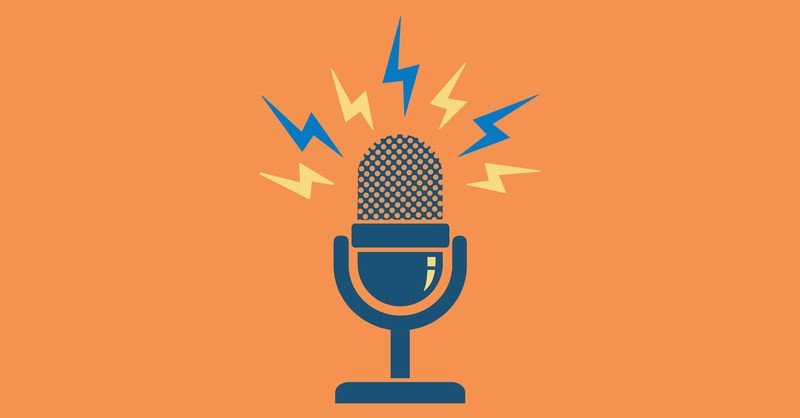

## Start listening to Podcasts
Podcasts is a great way to learn from other people about things that interest you and share your thoughts and concerns on different issues with hosts from around the world. They cover a huge variety of topics you can choose from. Here are a few of them!

#### Comedy
* [Off Menu With Ed Gamble and James Acaster](https://play.acast.com/s/offmenu)
* [The Bert Show](https://play.acast.com/s/the-bert-show)
* [The Last Laugh](https://play.acast.com/s/last-laugh-daily-beast)
* [Your Kickstarter Sucks](https://play.acast.com/s/yourkickstartersucks)

#### News and Politics
* [The Economist Asks](https://play.acast.com/s/theeconomistasks)
* [Intelligence Squared](https://play.acast.com/s/intelligencesquared)
* [The New Abnormal](https://play.acast.com/s/the-new-abnormal)
* [The Global News Podcast](https://play.acast.com/s/globalnews)

#### Education
* [Connexions](https://play.acast.com/s/connexions-classroom)
* [BBC Earth Podcast](https://play.acast.com/s/bbcearthpodcast)
* [Nobel Prize Conversations](https://play.acast.com/s/nobelprizeconversations)

#### Technology
* [Daily Tech News Show](https://play.acast.com/s/dtns)
* [Cyber](https://play.acast.com/s/cyber)
* [Launch Pad](https://play.acast.com/s/wharton-entrep)
* [Brave New Planet](https://www.pushkin.fm/show/brave-new-planet/)
* [The WAN Show](https://play.acast.com/s/thewanshowpodcast)
* [Waveform](https://play.acast.com/s/waveform-the-mkbhd-podcast)

#### Business
* [Business Wars](https://play.acast.com/s/businesswars)
* [My First Million](https://play.acast.com/s/myfirstmillion)
* [TED Talks Daily](https://play.acast.com/s/tedtalks)
* [The Enthusiasts Show](https://open.spotify.com/show/12gv2o7uxW3hqCY2HVBkbl?si=jlzAtaBqSdeu7quW8vOnzg)
* [Planet Money](https://www.npr.org/sections/money/?t=1616235730554)

#### Games & Hobbies
* [Rusty Quill Gaming](https://play.acast.com/s/rustyquillgaming)
* [Whatculture Gaming](https://play.acast.com/s/whatculturegaming)
* [WayPoint Radio](https://play.acast.com/s/vicegamingsnewpodcast)
* [Running Commentary](https://play.acast.com/s/runningcommentary)
* [Kingdom Smarts](https://play.acast.com/s/kingdom-smarts)

### Do you have ideas you want to share? Create your own Podcast!
Here are a few simple steps to help you start:

1. Choose a topic that interests you. You could also pick a co-host to share the journey with and make it more fun!
2. Choose a name that best describes the content of your Podcast.
3. Create the cover art of the Podcast. Be creative!
4. Get a good quality microphone. The sound quality of the Podcast is very important.
5. Record and edit the episodes. A nice free option to start with is [GarageBand](https://www.apple.com/mac/garageband/).
6. Upload your episodes!
7. Spread the word and let people know about your content. You can use [Buzzsprout's](https://www.buzzsprout.com/) social sharing feature to help you.

Source: https://www.podcastinsights.com/start-a-podcast/

---

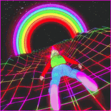

##  Trippy Gifs!

### If you are bored to do any of the above just watch those trippy gifs and time will pass

Gif source: https://tenor.com/view/cat-endless-trippy-sigh-gif-5424822/

Gif source: https://tenor.com/view/trippy-cool-aesthetic-gif-5468929/

Gif source: https://imgur.com/gallery/4p6Du/

Gif source: https://gr.pinterest.com/pin/121878733647068437/

Gif source: https://imgur.com/gallery/4p6Du/

Gif source: https://gr.pinterest.com/pin/255438610098286748/

Gif source: https://giphy.com/gifs/psychedelic-scifi-fractals-l4JyMhNmNSZIBFtjG/

Gif source: https://giphy.com/gifs/tumblr-featured-sheepfilms-3Kwo4SFbdQcIo

Gif source: https://giphy.com/gifs/tumblr-featured-sheepfilms-building-zoom-pZvnLIFQxbKfK/

Gif source: https://gr.pinterest.com/pin/518617713341925156/

Gif source: https://gr.pinterest.com/pin/346847608801164088/

Gif source: https://gr.pinterest.com/pin/132293307794459075/

Gif source: https://gr.pinterest.com/pin/434738170254293120/

Gif source: https://gr.pinterest.com/pin/535506211915299573/

Gif source: https://gr.pinterest.com/pin/825847650397358846/

Gif source: https://gr.pinterest.com/pin/360076932691017349/

Gif owned by [giphy.com](https://giphy.com/ "giphy.com")

---

## Video Games

Amazing video games you must try out:

* [Among Us](https://innersloth.com/gameAmongUs.php)
* [Assetto Corsa](https://www.assettocorsa.it/home-ac/)
* [Call of Duty: Black Ops](https://www.callofduty.com/blackops)
* [Call of Duty: Warzone](https://www.callofduty.com/warzone)
* [Dota 2](https://blog.dota2.com/?l=greek)
* [Drakensang Online](https://www.drakensang.com/en)
* [FIFA 2021](https://www.ea.com/games/fifa/fifa-21)
* [Fortnite](https://www.epicgames.com/fortnite/en-US/home)
* [Forza Horizon 4](https://forzamotorsport.net/en-us/games/fh4)
* [God of War](https://www.playstation.com/el-gr/games/god-of-war/)
* [GTA San Andreas](https://www.rockstargames.com/games/sanandreas)
* [GTA V](https://www.rockstargames.com/V/restricted-content/agegate/form?redirect=https%3A%2F%2Fwww.rockstargames.com%2FV%2F&options=&locale=en_us)
* [Hearthstone](https://playhearthstone.com/en-us)
* [League of Legends](https://na.leagueoflegends.com/en-us/)
* [Minecraft](https://www.minecraft.net/en-us/)
* [NBA 2K21](https://nba.2k.com/)
* [PES 2021](https://www.konami.com/wepes/2021/eu/en/ps4/)
* [Red Dead Redemption II](https://www.rockstargames.com/reddeadredemption2/restricted-content/agegate/form?redirect=https%3A%2F%2Fwww.rockstargames.com%2Freddeadredemption2%2F&options=&locale=en_us)
* [World of Warcraft](https://worldofwarcraft.com/en-us/)
* [Vendetta Online](https://www.vendetta-online.com/)

You can buy amazing video games for Windows, Mac and Linux computers in the following online stores:
* [Battle.net](https://eu.shop.battle.net/en-gb)
* [Epic Games Store](https://www.epicgames.com/store/en-US/)
* [Good Old Games (GOG)](https://www.gog.com/)
* [Origin](https://www.origin.com/irl/en-us/store)
* [Steam](https://store.steampowered.com/)
* [Ubisoft Store](https://store.ubi.com/ie/home)

The stores above usually feature deals and discounts on specific games. In order to be informed about the best current deals about a specific game, check out [IsThereAnyDeal](https://isthereanydeal.com)!

---

##  Video Making
Creating videos is a very fun and creative way to spend your time during lockdown(s) and who knows, you might as well make some money! Below you can find some interesting ideas to start with:

- Create short films. (More [here](https://www.filmmakingstuff.com/filmmaking-lesson-8-make-some-short-films/)).
- Create tiktok videos. (More [here](https://www.tiktok.com/?lang=en)).
- Start vlogging. (More [here](https://nofilmschool.com/how-to-start-vlogging)).
- Start live streaming. (More [here](https://www.boxcast.com/blog/how-to-start-live-streaming)).
- Start a youtube channel. (More [here](https://www.adorama.com/alc/10-tips-for-starting-a-youtube-channel/))

Section icon owned by [freepik](https://www.freepik.com/).

---

## Create your own video game
If you are a fan of video games, you can create your own game. All it takes is creativity and willpower.
Ηere you can find the most famous [game engines](https://en.wikipedia.org/wiki/Game_engine "What is game engine?") that will help you develop your own game.

|Name|Since| Famous Games |
|---|---|---|
|[Unreal](https://www.unrealengine.com/en-US/ "Unreal Home Page")|1998| Borderlands 2 |
|[Unity](https://unity.com/ "Unity Home Page")|2005| Rust |
|[Amazon Lumberyard](https://aws.amazon.com/lumberyard/ "Lumberyard Home Page")|2016|
|[CryEngine](https://www.cryengine.com/ "CryEngine Home Page")|2002| Ryse: Son of Rome |

 
More info: 

[What Are the Most Popular Game Engines?](https://www.perforce.com/blog/vcs/most-popular-game-engines)

---

## Virtual Tours-Trips
Tired of sitting at home?
Why don't you take a virtual tour via **youtube**?

[Come and relax on youtube's virtual trips now!](https://www.youtube.com/watch?v=2Qcf1K3hP2g)

Do you want to drive around your favorite cities while listening to their local radios?
If yes, then you should definitely try the [Drive & Listen APP](https://driveandlisten.herokuapp.com/?fbclid=IwAR2jQV27oRk5A4UmCgGNEKwu2JXxDCuqm-6sqKrmLalAnO2N7bjXGVgcnhg)!

Take a look at any country from a drone's perspective! If you prefer exploring a country from above, visit [Fly & Listen](http://flyandlisten.com/?fbclid=IwAR2uuxF_Xd0vKNfpXIlh9N5f4nItuzQ-Lbhbj4WpC4CMWHgKd-EeVrYlvwg). You can choose
a destination, pick a local radio station and enjoy your virtual trip. Fly and listen offers you a great variety of places to visit and a lot of different options regarding the local radio station. You are free to pick your favorite, sit back and relax!

Due to the Covid-19 pandemic museums remain closed. Don't worry, art lovers!

You can have a look on the [online exhibition](https://www.vangoghmuseum.nl/en) offered by the Vincent van Gogh Museum in Amsterdam.

Some of us are _bored in the house-in the house bored_!

[WindowSwap](https://www.window-swap.com/) is a quarantine project which gives you the opportunity to enjoy the view from windows around the world!

---

## Walks in Town
Here a some sights and places which are definitely worth to make a walk at: 

### Athens

Photo owned by [greeking.me](https://greeking.me/blog/visiting-athens/item/88-50-things-to-do-in-athens)

* Climb to the Acropolis ([map](https://g.page/acropolis-bnb?share))
* Take a walk to the Likavitou hill ([map](https://goo.gl/maps/9XdfRDUmPeepZp2W6))
* Run around the Philopappos monument ([map](https://goo.gl/maps/qkz8KnM6fjswxCx46))
* Stroll around in the harbour of Piräus ([map](https://g.page/acropolis-bnb?share))
* Go walk at Stavros Niarchos Foundation Cultural Center ([map](https://goo.gl/maps/T1bH1XBxXFDUxyLR9))
* A walk in Sygrou Park ([map](https://goo.gl/maps/Ae1pVnMKBdSEHfMQ9))
* Walk alongside Illissos river in Kallithea ([map](https://goo.gl/maps/zJaYh1aShCi9jkr68))
* Explore Plaka alleys and reach Anafiotika and Monastiraki ([map](https://goo.gl/maps/QY2uGpjgaqKiTGDA7))
* Walk from Monastiraki all the way to Thisio ([map](https://goo.gl/maps/uqFYkQhrpb8Cjabh7))
* Walk around the National Garden in the city centre ([map](https://goo.gl/maps/UcS2wfVs5EeSfSHJ8))
* Go on a mountain hike in Mount Ymittos ([map](https://goo.gl/maps/srLnLmzefot26tiE9))
* Walk around Koukaki neighbourhood ([map](https://goo.gl/maps/DErjSLYHLUyi3AdYA))
* Take a walk to Flisvos Marina ([map](https://www.google.com/maps/place/%CE%9C%CE%B1%CF%81%CE%AF%CE%BD%CE%B1+%CE%A6%CE%BB%CE%BF%CE%AF%CF%83%CE%B2%CE%BF%CF%85/@37.9311938,23.682856,17z/data=!3m1!4b1!4m5!3m4!1s0x14a1bc1061760f69:0x814330c59b77c2ac!8m2!3d37.9311938!4d23.6850447))
* Hiking at the Tatoi Royal Estate ([map](https://www.google.com/maps/search/Tatoi+Royal+Estate/@38.1584415,23.785362,15z/data=!3m1!4b1))
* Have a picnic in Eleftherias Park ([map](https://www.google.com/maps/place/%CE%A0%CE%AC%CF%81%CE%BA%CE%BF+%CE%95%CE%BB%CE%B5%CF%85%CE%B8%CE%B5%CF%81%CE%AF%CE%B1%CF%82,+%CE%91%CE%B8%CE%AE%CE%BD%CE%B1+115+21/@37.980496,23.7532421,15z/data=!4m5!3m4!1s0x0:0x15ddf444020efbf!8m2!3d37.980496!4d23.7532421))

### Thessaloniki

Photo owned by [discovergreece.com](https://www.discovergreece.com/macedonia/thessaloniki)

* Ladadika port ([map](https://goo.gl/maps/YDaDSL5Mi1fC69wC7))
* Seih Sou forest ([map](https://goo.gl/maps/iK8rm1ogkinfoP7d6))
* The Roman Forum and Agios Dimitrios Church ([map](https://goo.gl/maps/Shdhy5KCwZGaVC716))
* Tsimiski Street ([map](https://goo.gl/maps/HUyptTX7PFwYESXS6))
* Along the waterfront ([map](https://goo.gl/maps/Z2pXgpZxiUaJ9nF47))
* Aristotelous square ([map](https://goo.gl/maps/wLecvCpb8Z6j3sMS8))
* White Tower ([map](https://goo.gl/maps/6Gr19cabE4eZsLKRA))
* Navarino square ([map](https://goo.gl/maps/vs5Fe3jtGUTvhr7E7))
* Upper town and Eptapyrgio ([map](https://goo.gl/maps/4h8NoDRA9HPF5oUUA))
* Western wall ([map](https://goo.gl/maps/vHeqWpBXy4Yrczrf8))
* Axios Delta National Park ([map](https://goo.gl/maps/5e696rGw7pz9jzSEA))

### Patras

Photo owned by [zoogla.gr](https://www.zougla.gr/greece/article/i-patrini-gourou-ton-drones-mas-dixnoun-tin-patra-opos-tin-vlepoun-i-aeti)

* Run around Patras' lighthouse ([map](https://www.google.com/maps/place/%CE%A6%CE%AC%CF%81%CE%BF%CF%82/@38.24507,21.723487,17z/data=!3m1!4b1!4m5!3m4!1s0x135e49daf92b49dd:0xdb80e6e11329275b!8m2!3d38.24507!4d21.7256757))
* Explore South Park ([map](https://www.google.com/maps/place/%CE%9D%CF%8C%CF%84%CE%B9%CE%BF+%CE%A0%CE%AC%CF%81%CE%BA%CE%BF+%CE%A0%CE%AC%CF%84%CF%81%CE%B1%CF%82/@38.234853,21.7222076,17z/data=!3m1!4b1!4m5!3m4!1s0x135e362f6b19261b:0x7f2023f2baff8160!8m2!3d38.234853!4d21.7243963))
* Walk around patras' plage park ([map](https://www.google.com/maps/place/%CE%A0%CE%AC%CF%81%CE%BA%CE%BF+%CE%A0%CE%BB%CE%B1%CE%B6/@38.280133,21.7436127,17z/data=!3m1!4b1!4m5!3m4!1s0x135e499674859c5d:0x8c4e8a5324cc7749!8m2!3d38.280133!4d21.7458014))
* Walk around in the port area ([map](https://www.google.com/search?tbs=lf:1,lf_ui:2&tbm=lcl&sxsrf=ALeKk00CdZZzhv0AYhne4GN6JjWQ5xDyLA:1616521399540&q=%CE%BB%CE%B9%CE%BC%CE%B1%CE%BD%CE%B9+%CF%80%CE%B1%CF%84%CF%81%CE%B1%CF%83&rflfq=1&num=10&ved=2ahUKEwj8-qm--8bvAhUtAWMBHd5XBhoQtgN6BAgBEAc#rlfi=hd:;si:;mv:[[38.2289136,21.7223068],[38.2138512,21.719319499999997]];tbs:lrf:!1m4!1u3!2m2!3m1!1e1!1m4!1u2!2m2!2m1!1e1!2m1!1e2!2m1!1e3,lf:1,lf_ui:2))
* Walk alongside a patras' beach. [See all patras' beaches in the map.](https://www.google.com/search?tbs=lf:1,lf_ui:1&tbm=lcl&sxsrf=ALeKk02rgnIi8Y5qwuvlA3J3QMbb-wIFxA:1616521647696&q=patras+beaches&rflfq=1&num=10&ved=2ahUKEwjBlNS0_MbvAhWJlqQKHQwnD_gQtgN6BAgyEAc)
* Explore Patras Mycenaean Park-Voundeni [(map](https://www.google.com/maps/place/%CE%9C%CF%85%CE%BA%CE%B7%CE%BD%CE%B1%CF%8A%CE%BA%CF%8C+%CE%9D%CE%B5%CE%BA%CF%81%CE%BF%CF%84%CE%B1%CF%86%CE%B5%CE%AF%CE%BF+%CE%92%CE%BF%CF%8D%CE%BD%CF%84%CE%B5%CE%BD%CE%B7%CF%82/@38.252451,21.7826245,15z/data=!4m2!3m1!1s0x0:0xeff6c71133ac1c90?sa=X&ved=2ahUKEwiDj6qY-8bvAhXT8eAKHc4yChQQ_BIwG3oECCkQBQ))

### Mykonos

Photo owned by [adornosuites.com](https://www.adornosuites.com/top-10-best-things-to-do-on-mykonos-island-greece/)

* Explore the magical streets of Mykonos town ([map](https://www.google.com/maps/place/Mikonos+846+00/@37.444457,25.3180739,14z/data=!3m1!4b1!4m5!3m4!1s0x14a2bf06bf0fdd37:0xfaa85debe77b7a44!8m2!3d37.4467185!4d25.3288623?hl=en))
* Walk around the square of Ano Mera village ([map](https://www.google.com/maps?q=ano+mera+mykonos&source=lmns&bih=722&biw=1519&hl=en&sa=X&ved=2ahUKEwie4pvDls7vAhWT0oUKHTp1BuAQ_AUoAnoECAEQAg))
* Enjoy your walk around Kanalia while enjoying the fabulous Mykonos sunset ([map](https://www.google.com/maps/search/kanalia+mykonos/@37.4342891,25.3077225,16z/data=!3m1!4b1?hl=en))

Sources: [thebest.gr](https://www.thebest.gr/article/412935-), [tripadvisor](https://www.tripadvisor.com/Attractions-g189488-Activities-c47-t76-Patras_Achaea_Region_West_Greece.html)

---

##  What to avoid
Being isolated all day long can make you a person, that you in the future would be ashamed for. To prevent such a situation, make sure you avoid the following.

* Reality TV Shows:
  
  * Survivor
  * Battle of the couples
  
* Fast food
* Recommended youtube videos
---

##  Work with cars!
Do you like cars? Of course you do! Who doesn't?

### Config your dream car by brand:
* [Audi](https://configurator.audi.com/acc/configurator/v1/gre/gre)
* [BMW](https://www.bmw.gr/el/configurator.html)
* [Mercedes-Benz](https://www.mercedes-benz.gr/passengercars/configurator.html)
* [MINI](https://configure.mini.com.gr/el_GR/model-ranges?clc=MINI.Digital&ctid=Google_GSN_Text_Brand_1581&ccid=1581&tl=sea-gl-GR_2021_MINI_AR_GoogleSearch_Brand_Details_TextAd_Exact-mix-miy-.-sech-Brand%20configurator-.-e-mini%20configurator-.-.&gclid=CjwKCAjwgOGCBhAlEiwA7FUXkowCVAF4evECQerRrzXvjCB-MMwEBN0iZeWuttJ5eIXxcJDy3mtgJxoCcTAQAvD_BwE)
* [Porche](https://www.porsche.com/central-eastern-europe/en/_greece_/modelstart/)
* [VW](https://www.volkswagen.gr/el/models-and-configurator.html)

### Building your car from scratch ? Here are some websites with parts (used and new):
* [Car.gr](https://www.car.gr)
* [Offroad parts](https://www.xtreme4x4.gr)

Section icon Source: https://2sleepylagoonter.info/car-news/best-cars/top-10-best-sports-cars

### If you like car videos you should definitely check these youtube channels:

* [1320video](https://www.youtube.com/user/1320video/videos)
* [Car Throttle](https://www.youtube.com/user/CarThrottle/videos)
* [CARWOW](https://www.youtube.com/channel/UCUhFaUpnq31m6TNX2VKVSVA) (Highly recommended) 
* [ChrisFix](https://www.youtube.com/user/PaintballOO7/videos)
* [DRIVE](https://www.youtube.com/user/drive/videos)
* [Jay Leno's Garage](https://www.youtube.com/user/JayLenosGarage/videos)
* [Mighty Car Mods](https://www.youtube.com/user/mightycarmods/videos)
* [Motor Trend Channel](https://www.youtube.com/user/MotorTrend/videos)
* [Scotty Kilmer](https://www.youtube.com/user/scottykilmer/videos)
* [Supercar Blondie](https://www.youtube.com/user/nikhirschi/videos)
* [Top Gear](https://www.youtube.com/user/TopGear/videos)

Source for youtube links: https://blog.feedspot.com/car_youtube_channels/

---

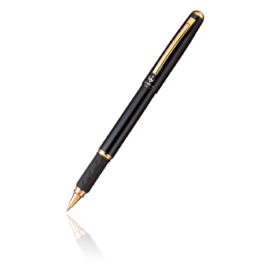

##  Writing
Writing is a skill that I consider to be underestimated. Written communication is everywhere around us; in emails, articles or even in remote work where slack messages are the default form of communication.
There are many types of content produced by writing, like for example:
- Novels
- Short stories
- Academic papers
- Personal journals: Here are some journaling prompts to help your reflection journey:
	- What are the 3 biggest lessons you've learned over the last year?
	- Write down 10 things no one knows about you.
	- Close your eyes and take yourself on your favorite walk. What do you observe?
	- What is a resolution you made in January that you have let slip? How can you pick it back up?
	- What gives you hope for the rest of this year? Why is 2021 a good one?
	- What are your 10 favorite things about yourself?
	- Look around your room. What are you grateful for today in the ordinary?
- Technology documentations
- Blog posts
- And the list goes on

Writing is most often a solitary activity, except for people who like to write in cafe's. The ongoing lockdown is a great opportunity to start practicing writing. I will kick it off with one important tip that I've found to be helpful whenever I'm writing something for other people to read.

__Editing__ and __Writing__ are not the same thing. Whenever you write something, leave it for a few hours or maybe a few days. And then come back to it as an __editor__ to find ways to make it more captivating and understandable for the readers.

---
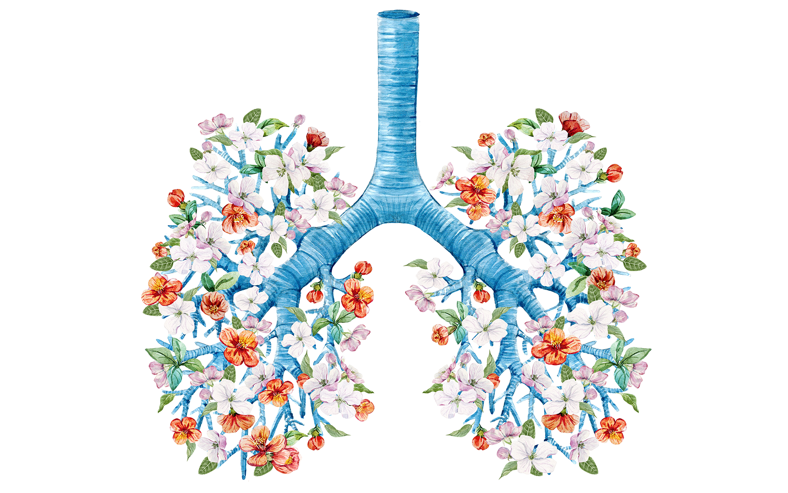

##  Lead a Healthy Life
Image owned by: [mindful.org](https://www.mindful.org/use-breath-strengthen-mind/)

* Exercise Regularly
* Eat Heathy
* Drink Plenty of Water
* Think Positive

Image owned by:[indianfolk.com](https://www.indianfolk.com/effects-healthy-food-personal-life-environment-mahek/)

Being healthy should be part of your overall lifestyle. 
Living a healthy lifestyle can help prevent chronic diseases and long-term illnesses.

Feeling good about yourself and taking care of your health are important for your self-esteem and self-image. 

Maintain a healthy lifestyle by doing what is right for your body.
Now is the time to start caring about yourself by eating right and exercising regularly! You need to stay active and not sink into your couch. The lockdown is your chance to change the things you don't like about your life and yourself. You have more time than ever to learn about physical and mental health and find inner peace.

Image owned by: [blog.usejournal.com](https://blog.usejournal.com/a-full-body-workout-you-can-do-anywhere-7c12513120c4)

We all have different needs according to our workout and diet habits. 
Since this section is all about the motivation of the reader we would say that it focuses more on the needs of the inactive rather than the active people.
Workout and diet plans should be decided after consideration of our short term goals. For example a currently inactive person except of gaining stamina and endurance, he might also want to  lose some weight. Or somebody might not be concerned about weight loss and just want to build muscle strength. Or maybe he just wants to create a healthy and balanced lifestyle due to eating disorders.  On that account, different short term goals require different meal and workout plans. Although it is possible even during the lockdown to visit a dietitian there are plenty of applications or websites, free or with a monthly/yearly subscription (probably more accurate) to help you create a plan and stick to it.

Image owned by: [stack.com](https://www.stack.com/a/how-to-become-a-morning-workout-person)

Quarantine comes with many challenges regarding your health. It’s hard to maintain a balanced diet when you are home for most of the day, with a reduced social life and not much to do. That can lead to decreased productivity  and a pessimistic attitude to life. That’s why it is important to keep taking care of yourself. Learn to appreciate the value of sleep and don’t forget to go out for a walk or a quick run at least once a day. Create a daily routine that you enjoy to follow and learn to love your body and yourself.

Create a balanced diet that suits your needs and will eventually help you reach your goal. Follow a weekly workout routine.
Working outside is an option during the lockdown so even though you can't go to the gym, you can still go for a run, get some fresh air and power your Mental Health batteries. Some yoga is always a good workout option to strengthen your body and relax. Depending on your skills there are many workout programmes depending on your current level (beginner to intermediate). Create your plan:

* how many days per week
* what kind of workout each day

There are apps that can help you track your progress and motivate you to keep going
([tomsguide.com](https://www.tomsguide.com/best-picks/best-workout-apps)).
To remind you to drink the appropriate amount of water and to count the calories intake per  day. ([healthline.com]( https://www.healthline.com/health/hydration-top-iphone-android-apps-drinking-water) , [learningenglish.voanews.com](https://learningenglish.voanews.com/a/personal-tech-healthy-eating-fitness-apps/3958706.html#:~:text=MyFitnessPal%20is%20an%20app%20that,more%20information%20about%20healthy%20eating.)).

Check out [health.gov](https://health.gov/myhealthfinder/topics/health-conditions/diabetes/eat-healthy#:~:text=A%20healthy%20eating%20pattern%20can%20help%20keep%20you%20healthy.&text=Making%20smart%20food%20choices%20can,Heart%20disease), [medicalnewstoday.com]( https://www.medicalnewstoday.com/articles/322268), [everydayhealth.com]( https://www.everydayhealth.com/diet-nutrition/importance-healthy-eating-habits/) to learn why you need o stay healthy and how.
Also [greatist.com](https://greatist.com/fitness/best-health-fitness-apps#other) has may apps to suggest depending on your food and fitness interests. Check it out and start living your new life.

Image owned by: [dreamstime.com](https://www.dreamstime.com/photos-images/healthy-life)
<image width="500" src="media/images/healthylife.jpg">

Source: <https://www.foundationforpn.org/living-well/lifestyle/#:~:text=Being%20healthy%20should%20be%20>

---

## Note : Before you head outside
1. *Be sure you wear a mask*
2. *Don't forget to sent the obligatory SMS text message to 13033*:
You can send SMS from your mobile phone to 13033 free of charge.
The SMS must be in the following format:

        X [blank] full name and home address

    where X is the reason for movement 1, 2, 3, 4, 5, 6 corresponding to the following reasons:

    1. Movement to the pharmacy or visiting a doctor or to donate blood, in the case that this is recommended after a previous communication.
    2. Movement to an in-service supply store of basic goods (supermarket, mini-market), where they cannot be sent out.
    3. Movement to a public service or bank, insofar as electronic transaction is not possible.
    4. Movement to help people in need or escort minors to/from school.
    5. Movement to a funeral ceremony under the conditions laid down by law or movement of divorced or separated parents necessary to ensure communication between parents and children, in accordance with the provisions in force.
    6. Physical exercise outdoors or movement with a pet, individually or per three persons, in the latter case having regard to the necessary distance of 1.5 m.

    You will receive the following in response:

        Movement [blank] X [blank] full name and address of residence

    *Source:* https://forma.gov.gr/en/ 
    
    *Tip:* In case you have a foreign phone number - not starting with 003069...- the SMS process will not work, you are obligated to print and carry this page https://forma.gov.gr/docs/permit-extraordinary-movement-en.pdf an tick the number that complies with the type of your movement.
3. *Be sure to comply with the law*: (description needed)

**Important:** Depending on your area of residence, a different type of lockdown may be imposed.
Before any outdoor activity, you should visit [the official Covid-19 map](https://covid19.gov.gr/covid-map/), which contains information about the different safety 
regulations that are currently active on every Greek regional unit. For information in english check out the [ESN Greece website](https://esngreece.gr/covid-19-official-announcements-news?fbclid=IwAR2oBA5IpSgOAEUHQpEcHa3UwRY3XgJDFZZ9GtFot1GrPDaxrb775dnh_oM)

---

_Section icons owned by [Pichon](https://icons8.com/app/windows)_
